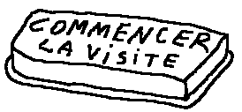

# turing-test

Turing Test est un projet de création théâtrale de Fabien Carbo-Gil, Bertrand Lenclos et Léon Lenclos de la Cie Nokill qui traite du rapport que l'humain entretient avec les machines qu'il a créées.

Le spectalce est actuellement en cours de création. Nous avons décidé de rendre le processus de création ouvert. Vous trouverez ici les textes que nous somme en train d'écrire, les idées qui germent, le spectacle qui jours après jours prend forme.

