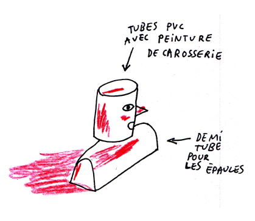
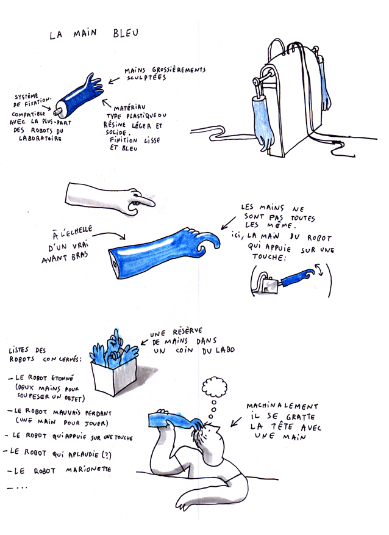

# Esthétique

Les choix esthétiques principaux.

Les Robots
----------

Plusieurs pistes ont étés évoquées pour donner une cohérence esthétique à la famille de robot :

### Les robots ne ressemblent pas au cliché qu'on se fait des robots

Il faut éviter l'esthétique rétro-futuriste qui vient d'abord en tête quand on pense à un robot.

Ces robots sont tellement des robots que ce n'est pas la peine qu'en plus de ça ils ressemblent à des robots.

### L'apparence des robot est le reflet d'une obsession des chercheurs

Ce n'est pas évoqué clairement pendant le spectacle mais quand on regarde les robots, il apparait évident que les chercheurs sont obsédés par telle chose.

Telle chose peut être par exemple les fourmis. Les robots seraient alors fourmoïdes.

### Les robots ont tous un élément en commun

Dans le dessin animé Futurama, les robots ont tous une antenne.

Les robots de turing test pourraient par exemple avoir tous un long nez.

### Les robots et les chercheurs ont tous un élément en commun

Dans l'idée de se convaincre qu'ils sont leur égal, les chercheurs ont décidés que vu qu'ils portaient tous une blouse, il n'y avait pas de raison pour que les robots n'en portent pas une aussi.

Cette idée peut porter sur autre chose que la blouse. Des lunettes ? Une casquette ?

### Les robots sont colorés

Le robot cliché est métallique ou blanc. Une idée serait de prendre le contre-pied de ça et de faire des robots colorés.

### Les robots ont des cables qui leur sortent de la tête

Tous les robots électriques ont ce point commun d'être branchés par en haut. C'est visuel et ça permet de faire passer les cables par le plafond plutôt que par le sol

### Certains robots ont des points communs

Par exemple le bras du robot qui perd au jeu ressemble beaucoup à ceux du robot étonné.

---

[Retour aux notes d'intention](.)
