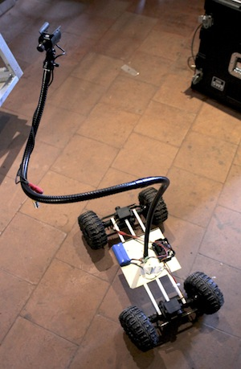
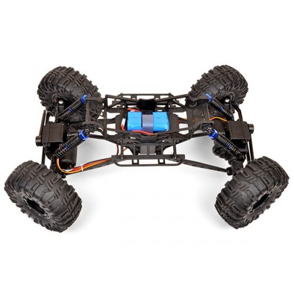
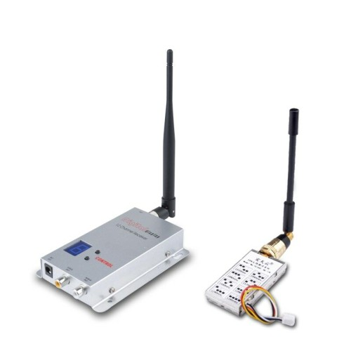

# Caro V 0.1

## Description générale

Caro, le Robot-caméra, filme les évènements du labo et projette les images sur l'écran A du labo

Proposition de nom : Kino, Ciné, Iris, Zoom, Caro*

(<small>* Elio n'arrête pas de me parler d'une chef op qu'il a rencontré à l'école : [Caroline Champetier](https://fr.wikipedia.org/wiki/Caroline_Champetier)</small>)

## Allure

Fixé sur une structure mobile à 4 roues, un mat prolongé d'un col de cygne est équipé d'une caméra.

## Description technique

La strucure mobile est un hacking de Crawler télécommandé. La télécommande est gérée par le régisseur.
La caméra fixée au col de cygne délivre un signal à un émméteur HF qui transmet l'image jusqu'au vidéoprojecteur situé derrière l'écran de l'établi.

### Mécanique

- crawler modifié
- Mat téléscopique type pied de micro en alu
- col de cygne

#### Note relative aux objectifs utilisables sur la caméra

4 Objectifs :

On les range dans l'ordre de la plus courte à la plus longue focale.

On peut regarder la taille de l'iris : Plus petit trou = Plus courte focale

1.  très grand angle = .
2.  grand angle = °
3.  longue focale = o
4.  très longue focale = O

Autres signes distinctifs :

1.  Le pas de vis ne va pas jusqu'au bout
2.  Le plus grand pas de vis
3.  Inscriptions sur l'objectif
4.  Le dernier

Pour l'instant on selectionne le **2**

### Electronique

1,2 G TX 1000 mW 1000mW 8CH Transmitter RX02

### Software

non

## Améliorations envisagées

A venir

## Moment envisagé pour la construction et/ou les améliorations.

Du 15/3/2019 au 31/3/2019 à Graulhet

[Retour à la liste des robots du laboratoire](.)
