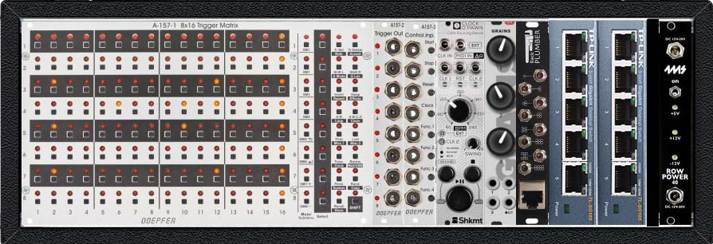
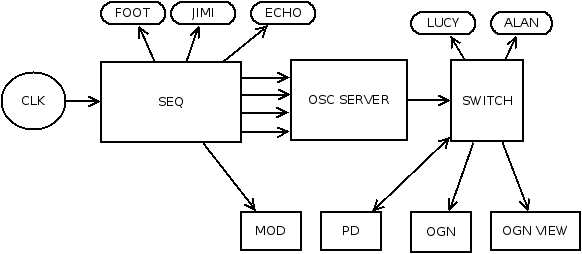

# Core v 0.0.1

## Description générale

Core est un robot chef d'orchestre. Il donne le tempo à toutes les autres créatures artificielles du Labo.

Le cerveau de Core

## Allure

À définir

## Description technique

Core est une machine pour synchroniser et mettre en reseau toutes les machines du Grim.

Voilà le schéma du réseau :

(source : [grim-network.dia](../../ressources/grim-network.dia))

- Foot, Jimi et Echo sont des robots en arduino avec un entrée gate
- Lucy et Alan des robots qui fonctionne en raspberry ou PC.
- SEQ = doepfer A 157-1/2/3
- CLK = Clock O'Pawn Shakmat Modular
- OSC SERVEUR = Raspberry Pi
- Mod = Synthé modulaire
- PD = pure date sur un Raspberry pour synthèse sonore
- OGN/OGN VIEW = Sur un PC + un Raspberry, OGNON, logiciel de création d'animation en temps réel.

### Mécanique

À définir

### Electronique

- Un commutateur 8 ports (e.g. *Switch réseau Gigabit RJ45 Netgear ProSAFE GS108GE 8 ports*)
- Un générateur d'horloge 
- Un sequenceur trig
- Un raspberry qui dispatche du OSC sur du Trig et vice versa

### Software

À définir

## Améliorations envisagées

A venir

## Moment envisagé pour la construction et/ou les améliorations.

Du 15/3/2019 au 31/3/2019 à Graulhet puis résidence 104 du 15 au 21 avril 2019
