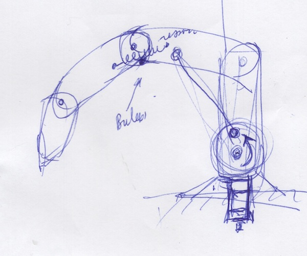
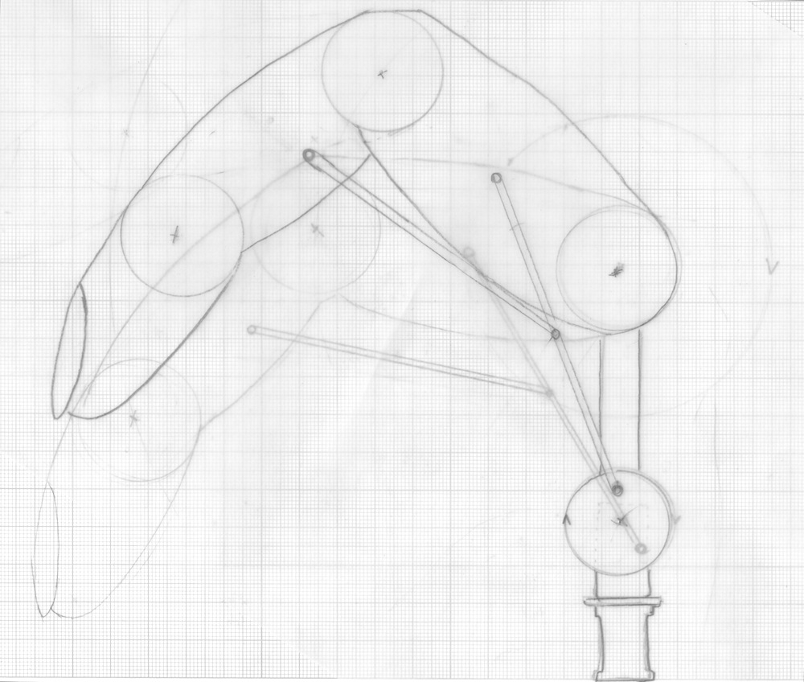

# DÉDO le robot musicien qui aime jouer.

## Description générale

Robot muni d'un doigt, il appuye sur les touches de jouets sonores ou de synthétiseurs pour enfants. Il a une entrée trigger et peut être détourné pour servir à nourrir Lucy.

## Comment ça marche ?

3 hypothèses de construction -

- Version 1D : un axe (vertical). un servo, un moyeu, une bielette, un segment doigt et un ressort pour amortir le contact avec l'instrument. Fixation sur spiggo et accessoire (bras magique, pied, rotule...)

- Version 2D : Même chose que la V 1D avec une rotation de l'ensemble. Plusieurs boutons de plusieurs jouets peuvent être enfoncés.

- Version 3D : Même chose que la V 2D avec la profondeur en plus. Robot du commerce type Dobot. peut jouer une partition complexe.

## Version 1D V0.1

## Moment envisagé pour la construction

Quelle version ?

[Retour à la liste des robots du laboratoire](.)
