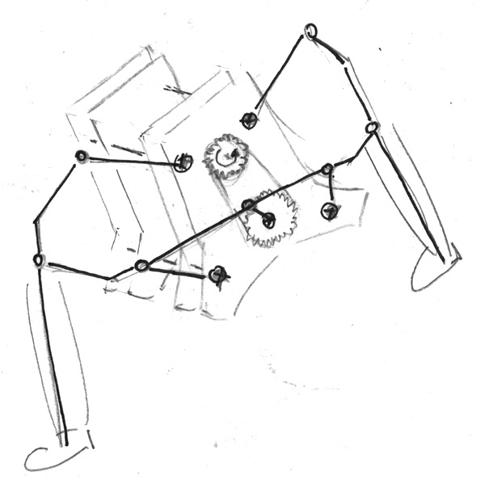
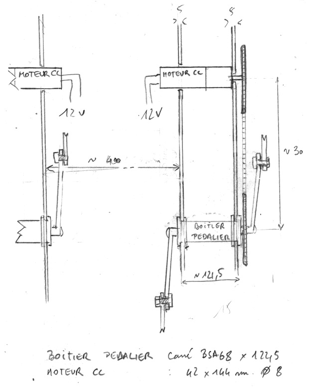
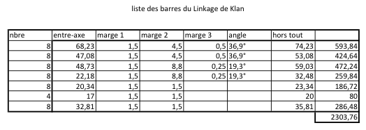
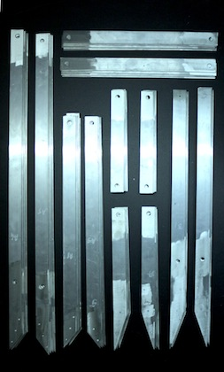
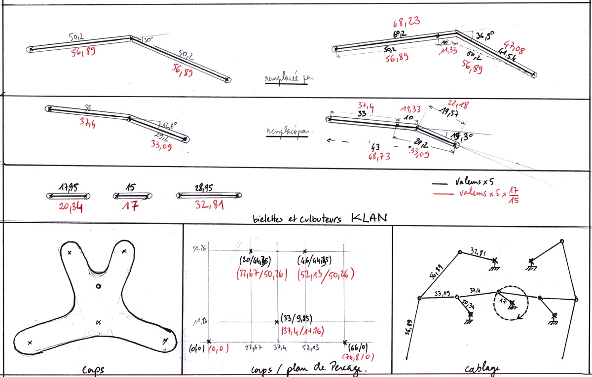
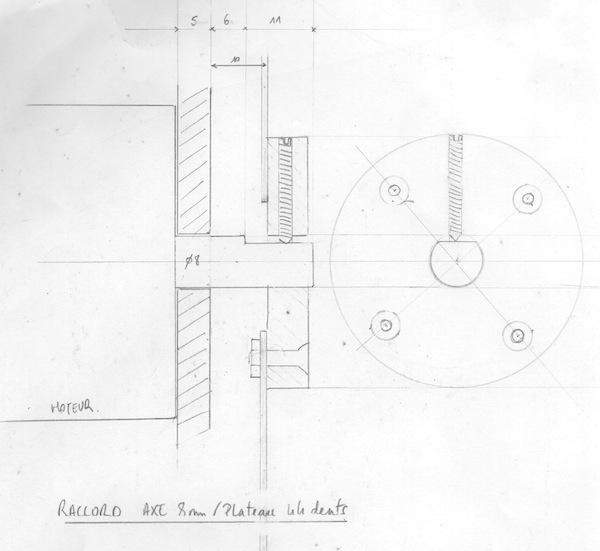

# Klan V 0.1

## Description générale

Klan est un robot doté de capacités de locomotion évoluées qui lui permettent de se déplacer dans des environnements encombrés. Il est équipé de 8 jambes actionnées par deux moteurs indépendants. Sa structure s'inspire du ([mécanisme de Klann/Klann's linkage](https://fr.wikipedia.org/wiki/Mécanisme_de_Klann)), développée par Joe Klann en 1994.


Animation répétitive du mécanisme de Klann


## Allure

Klan mesure environ 1,4m de haut pour 1,2m de long et 0,8m de large.
Sa structure ouverte et sans carter laisse apparaître l'intégralité du mécanisme.
Chaque jambe a l'apparence d'un tibia et d'un pied humain.
L'ensemble simule une marche synchronisée d'un groupe de quatre humains faisant les 100 pas.



## Matériaux 

Parties mobiles en Aluminium. Rondelle en Téflon PTFE et Visserie BTR M10 avec écrous Stop
Motorisation CC, transmission vélo-hacking et commande par arduino + schield moteur.

## Description technique

Le mécanisme d'une jambe se compose d'un segment qui entre en contact avec le sol, d’une manivelle, de deux culbuteurs, et deux biellettes tous reliés par des liaisons pivots.

Dans notre adaptation, la rotation des pivots s'effectue grace à des rondelles en Téflon, sauf pour les axes moteur, fixés sur des paliers appliques à la structure du corps.



## Liste matériel

### Mécanique

##### Bielles

- Plat Alu : 40mmx5mm (x20m)







##### Structure

4 plaque alu ep 5mm selon dessin (aquabrasion)

##### Visserie

- Boulon M10 40mmm (x26)
- écrou M10 Stop (x100)
- rondelle teflon 10/25 (x112)
- tige filetée M10 (x4m)

##### vélo-hacking / transmission

- 2 manivelles avec plateaux 32 dents
- 2 boitier + axe pedalier
- 2 plateaux 44 dents
- 2 tendeurs de chaines
- pièce à créer : raccord axe moteur 8mm + plateau 44 dents
- Chaines
- 2 entretoises 68mm

- [pedalier (manivelles:170mm)](https://www.ultimebike.com/ville/transmission/pedaliers/pedalier-city-monoplateau-33-dents-alu-l-170-mm-carre-argent.html?gclid=CjwKCAjwvbLkBRBbEiwAChbckQsCsgaN81SR-jGQMndwdmhDWQEbAijvN5KcBueUTV1TndRFm6VdURoCpTYQAvD_BwE)

##### Pièce à créer : raccord axe moteur 8mm + plateau 44 dents




### Electronique

- Arduino UNO
- Shield controleur
- Moteur CC
- Bouton Stop Urgence

### Software

Proposition en pseudo-code pour le programme de Klan
```
// constantes
constante ECARTEMENT_DES_JAMBES
constante LOOP_DELAY

// reglages
variable vitesse
variable longueur_d_un_aller
variable pause_avant_de_tourner
variable pause_apres_avoir_tourne
variable rayon_du_demi_tour
variable probabilite_de_faire_une_pause
variable duree_pause_pour_reflechir

fonction freiner():
   regler_vitesse_jambe_gauche(0)
   regler_vitesse_jambe_droite(0)

fonction faire_une_pause_pour_reflechir():
   une chance sur probabilite_de_faire_une_pause de :
       freiner()
       attendre(duree_pause_pour_reflechir)

fonction avancer(longueur):
   duree_totale = longueur / vitesse
   n = duree_totale / LOOP_DELAY
   pour i de 0 à n :
       attendre(LOOP_DELAY)
       regler_vitesse_jambe_gauche(vitesse)
       regler_vitesse_jambe_droite(vitesse)
       faire_une_pause_pour_reflechir()
   freiner()
   
fonction tourner_a_gauche(rayon):
   longueur_demi_tour_gauche = PI * rayon
   longueur_demi_tour_droit = PI * (rayon + ECARTEMENT_DES_JAMBES)
   vitesse_jambe_droite = vitesse
   vitesse_jambe_gauche = vitesse_jambe_droite * longueur_demi_tour_gauche / longueur_demi_tour_droit
   duree_totale = longueur_demi_tour_gauche / vitesse_jambe_gauche
   n = duree_totale / LOOP_DELAY
   pour i de 0 à n :
       attendre(LOOP_DELAY)
       regler_vitesse_jambe_gauche(vitesse_jambe_gauche)
       regler_vitesse_jambe_droite(vitesse_jambe_droite)
   freiner()
 
fonction faire_les_cent_pas :
    boucle infini :
        avancer(longueur_d_un_aller)
        attendre(pause_avant_de_tourner)
        tourner_a_gauche(rayon_du_demi_tour)
        attendre(pause_apres_avoir_tourne)

faire_les_cent_pas()
```
## Améliorations envisagées

A venir

## Moment envisagé pour la construction et/ou les améliorations.

Construction mécanisme du 15/3/2019 au 31/3/2019 à Graulhet.

[Retour à la liste des robots du laboratoire](.)
