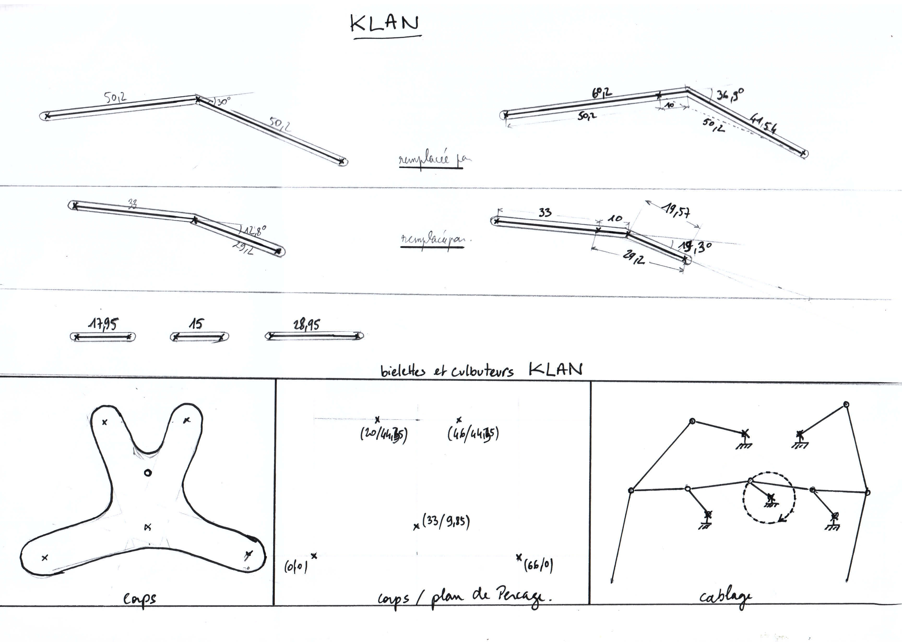

# Klan v0.0.1

## Description générale

Klan est un robot doté de capacités de locomotion évoluées qui lui permettent de se déplacer dans des environnements encombrés. Il est équipé de 8 jambes actionnées par deux moteurs indépendants. Sa structure s'inspire du ([mécanisme de Klann/Klann's linkage](https://fr.wikipedia.org/wiki/Mécanisme_de_Klann)), développée par Joe Klann en 1994.

Animation répétitive du mécanisme de Klann

## Allure

Klan mesure environ 1,4m de haut pour 1,2m de long et 0,8m de large.
Sa structure ouverte et sans carter laisse apparaître l'intégralité du mécanisme.
Chaque jambe a l'apparence d'un tibia et d'un pied humain.
L'ensemble simule une marche synchronisée d'un groupe de quatre humains faisant les 100 pas.

## Matériaux 

Parties mobiles en Aluminium. Rondelle en Téflon PTFE et Visserie BTR M10 avec écrous Stop
Motorisation et commande à définir.

## Description technique

Le mécanisme d'une jambe se compose d'un segment qui entre en contact avec le sol, d’une manivelle, de deux culbuteurs, et deux biellettes tous reliés par des liaisons pivots.

Dans notre adaptation, la rotation des pivots s'effectue grace à des rondelles en Téflon, sauf pour les axes moteur, fixés sur des paliers appliques à la structure du corps.

### Mécanique

- Liste matériel
- Plat Alu : 40mmx5mm (x20m)
- visserie : BTR M10 25mmm (x100) ! écrou M10 Stop (x100)
- Palier applique miniature ICI SKFL000 (x4)
- tige filetée M10 (x2m)

### Electronique

- Arduino UNO
- Shield controleur
- Moteur CC
- Bouton Stop Urgence

### Software

A venir

## Améliorations envisagées

A venir

## Moment envisagé pour la construction et/ou les améliorations.

Construction mécanisme du 15/3/2019 au 31/3/2019 à Graulhet.
