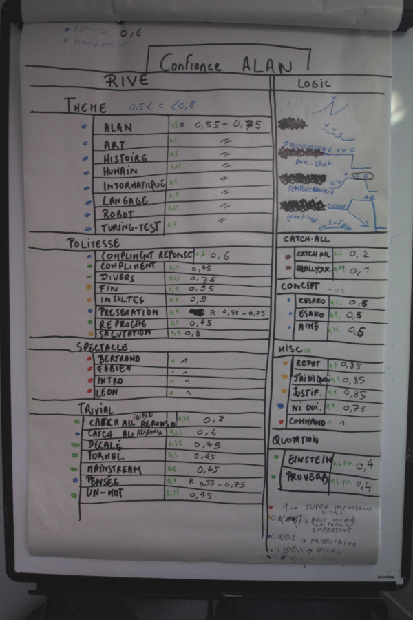
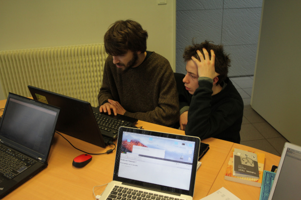

# Klan v0.0.1

## Description générale

Klan est un robot doté de capacités de locomotion évoluées qui lui permettent de se déplacer dans des environnements emncombrés. Il est équipé de 8 jambes actionnées par deux moteurs indépendants. Sa structure s'inspire du ([mécanisme de Klann](https://fr.wikipedia.org/wiki/Mécanisme_de_Klann)) (Klann's linkage). 


Animation répétitive du mécanisme de Klann


A une époque où la frontière entre le monde virtuel et l'IRL (la [vraie vie](https://fr.wikipedia.org/wiki/Vraie_vie)) est de plus en plus [difficile à tracer](https://books.google.ca/books?id=VwJ4xsYHboYC&pg=PA533&lpg=PA533&dq=%22Social+Relationships+and+Identity+Online+and+Offline%22&source=bl&ots=bpBvupth9B&sig=2JeW2bC5x0yakE8JZNXGNCobemY&hl=en&sa=X&ei=0l5CUaaxDdPE4AO-_IHACg&ved=0CDgQ6AEwAQ#v=onepage&q=%22Social%20Relationships%20and%20Identity%20Online%20and%20Offline%22&f=false), Alan incarne l'irruption du numérique dans le quotidien tout autant que le décloisonnement du spectacle. Une oeuvre n'est jamais définitivement enfermée dans un temps et un lieu. La communication qui est faite autour d'une performance ainsi que les discussions et les réactions qu'elle suscite en font partie intégrante. Alan participe à cet étalement du spectacle dans l'espace-temps. Il est éveillé sur scène, avant et après le spectacle, il peut participer aux discussions, aux débats et même aider à évacuer les gens si jamais l'alarme incendie vient à sonner.


## Allure
Structure  d'aluminium qui se replie sur elle-même pour ne former qu'un parallélépipède rectangle qui se range facilement.


Dans la structure sont fixés les éléments du hardware qui sont décrits dans la description technique.

## Matériaux 

Barres d'aluminium de section rectangulaire, matériel informatique.

## Description technique

### Hardware
Carte mère (avec le processeur et la carte grapique fixés dessus), refroidisseur, alimentation, boutons de façade et écran fixés dans la structure. 

### Software

[Le dépôt github de Alan](https://github.com/LeonLenclos/alan) est consacré au code source d'alan.

Les consignes d'écritures pour le développement d'Alan sont dans le fichier `brain/README.md` présent dans le dépôt github d'Alan. Cete page sert aux visiteurs et aux consignes d'installation.

L'architecture d'Alan est basé sur le module python [chatterbot](https://github.com/gunthercox/ChatterBot). Le programme d'Alan est ainsi composé de modules, des bouts de programmes qui répondent à des taches précises :
- Des modules servant à générer en fonction d'un texte entré par l'utilisateur une réponse sous forme de texte en fonction et un indice de confiance. Il sont appelés des LogicAdapter. Voici un tableau récapitulant le niveaundice de confiance pour chaque logic adapter:



- Un module servant à gérer la reconnaissance vocale (conversion voix vers texte) sera un InputAdapter
- Un module servant à gérer la synthèse vocale (conversion texte vers voix) sera un OutputAdapter

Lorsque l'utilisateur dis quelque-chose à Alan, certains logic adapters se mettront en marche et c'est la réponse de celui qui renverra l'indice de confiance le plus haut qui sera sélectionnée. Si tout les logic adapters ne se mettent pas en marche à chaque fois, c'est parce que certains ne sont conçus que pour répondre à un certain type de phrases. 

### Comment parler avec Alan

Quand on lance Alan sur son harware il faut :

- ouvrir un terminal (par exemple Alt+F2 puis `gnome-terminal`)
- changer la résolution de l'écran : `sh screen-setup.sh`
- redimensioner à la main la fenêtre du terminal
- lancer alan : `alan`

Vous pouvez également  installer le programme de Alan sur votre ordinateur.

**Version de python requise : Python 3.5**

Le projet est encore en cours de développement, github est un outil adapté à ce contexte : il existe plusieurs "branches" qui sont des versions plus ou moins avancées d'Alan. Le Alan contenu dans la branche `master` doit normalement pouvoir fonctionner, il en est pour l'instant à la version 1. Il existe par exemple une branche développement sur laquelle nous travaillons et qui peut donc contenir un certain nombre de problèmes pas encores résolus. En attendant de pouvoir parler avec Alan sur internet vous pouvez suivre les indications suivantes pour installer Alan sur votre ordinateur ! Tout d'abord il vous faut télécharger ce dossier git en cliquant sur clone or download, puis rentrer les commandes suivantes dans le terminal depuis le dossier alan :

 ```
  $ pip install -r requirements.txt
  $ python
  >>> import nltk
  >>> nltk.download("punkt")
  >>> quit()
  $ cd brain
  $ ./alan.py
  ```

#### commandes spéciales

Pour quitter

```
 > ciao
```

Pour une annalyse des logic adapters en jeu dans la dernière réponse

```
 > info
```
Pour noter les deux dernières répliques dans la liste todo.md

```
 > todo
```


## Améliorations envisagées

Remplacement de l'écran et mise en ligne. Intégration et réglage du mode impro, débuggage général. Fabrication d'une housse pour pouvoir couvrir Alan. Intégration d'enceintes au hardware. 
système d'amplification envisagé :
wondon 2X50W
https://www.audiophonics.fr/fr/modules-amplificateur/wondom-aa-ja32171-jab-2-50-module-amplificateur-stereo-class-d-2x50w-4-ohm-bluetooth-40-p-10847.html

## Moment envisagé pour la construction et/ou les améliorations

Résidences de programmation à l'IRIT au printemps 2018.
Montage et fabrication du hardware à l'usinotopie (mars 2018) et à Bessines (octobre-novembre 2018).
Résidence au quai des savoirs du 16 au 21 novembre 2018 pour une confrontation au public et pour avancer sur les améliorations en vue de la version 2.0.0 .



Résidence à l'IRIT, les joies de la programmation.
