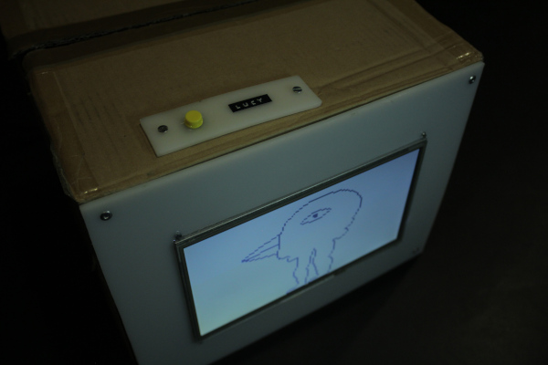
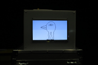
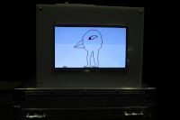
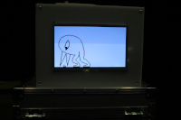
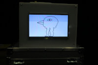

# Lucy

## Description générale

Lucy est une référence aux [tamagotchis](https://fr.wikipedia.org/wiki/Tamagotchi). C'est un personnage virtuel, il meurt si on le nourrit trop ou pas assez.

## Esthétique, allure du robot

Un simple écran avec un bouton au dessus : nourrir. Un personnage très pixellisé s'affiche à l'écran, en temps normal il bouge de légèrement dans son écran. Quand il est nourri, une animation est lancée. Il peut avoir l'air maigre, normal ou gros.

## Matériaux

Un carton avec un bouton fixé sur le dessus et un écran incrusté dans un des cotés du carton. Une platine en worbla sert de support au raspberry pi situé dans le carton.

## Mise en scène

Ce robot fait partie de la vie du labo, quelqu'un peut proposer de le mettre à jour mais cela pose des problèmes moraux aux autres qui se sont attachés à leur petit poisson pixellisé. En même temps ils s'en veulent aussi de maintenir en vie un poisson enfermé pour leur seul plaisir, ils résolvent le problème en adaptant le robot musicien pour qu'il nourisse le robot au lieu d'appuyer sur des touches de piano, ils se dédouanent ainsi de leurs responsabilités.

## Description technique

## Améliorations

- Connecter une entrée jack pour pouvoir recevoir un signal de trig ou de gate. Cela permettrait à Lucy de danser en rythme avec la musique.

- Logiciel : reset quand on appuie longtemps sur le bouton

- Logiciel : danse  en rhytme quand on envoie un trig

## Moment envisagé pour la construction
Construction à Bessines en novembre 2018
