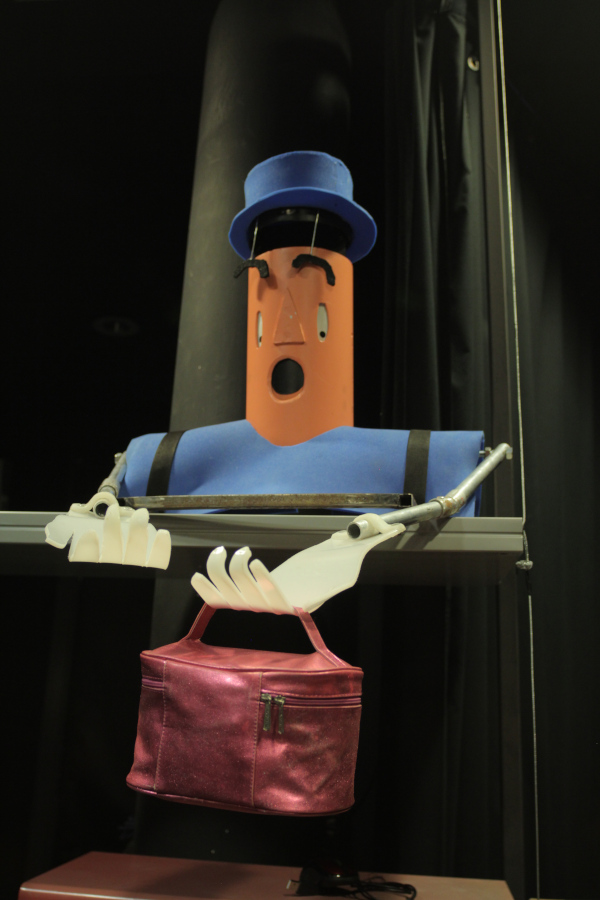

# Otto

## Description générale
Otto c'est le robot qui s'étonne. Son fonctionnement est simple. On lui présente un objet et il s'étonne. Otto nous permet de répondre par l'exemple à la question "Une intelligence-machine peut-elle éprouver des émotions"

## Allure

Un buste deux bras. Un visage expressif.
Otto dispose d'un nez (comme la plus part des antropomorphes) mais l'équipe préfère le lui enlever pour rendre son visage plus lisible.

## Matériaux

PVC, Plastazote, Mécanisme en acier.

## Description technique

Robot entièrement mécanique, le mécanisme est construit de manière à ce que lorsqu'un objet est posé sur le plateau, les traits de son visage se modifient pour qu'il ait l'air étonné : ses yeux se baissent vers l'objet déposé, sa bouche s'ouvre, ses sourcils et son chapeau se soulèvent.

L'enjeu est d'avoir un mouvement fluide lorsque l'on pose l'objet et lorsqu'on le retire. Pour ceci nous utilisons l'association d'un ressort et d'un piston. En plus de ramener quand il le faut le bras à sa position initiale, ce système à l'avantage de conserver les mouvements lents et de "filtrer" les mouvements rapides. Une analogie peut être faite avec ce qu'on appelle en synthèse sonore un filtre passe-bas.

## Moment envisagé pour la construction

Une première version a été construite à l'usinototpie.

