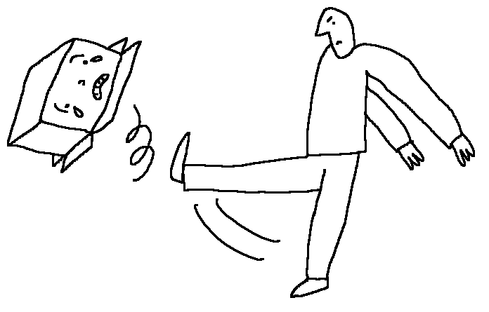
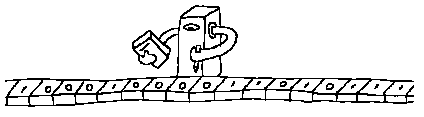
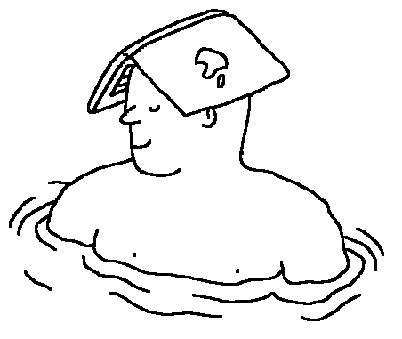
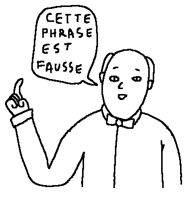
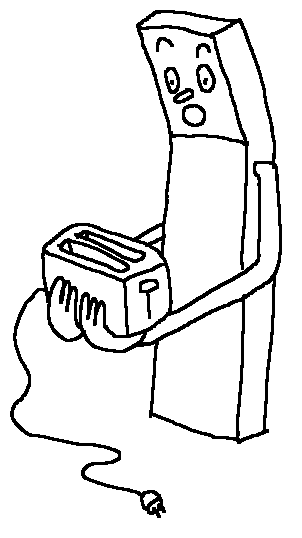
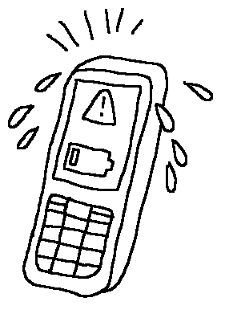

Hypothèse de mise en situation
==============================

Trois chercheurs dans un laboratoire éduquent une intelligence artificielle et font du cinéma.

Le Labo
-------

Trois chercheurs travaillent dans un laboratoire de robotique et d'intelligence artificielle. Ils se connaissent bien, collaborent ensemble depuis longtemps et parlent peu. Ils agissent, assemblent, expérimentent, testent, mettent à l'épreuve, démontent et remontent. L'ensemble forme une sorte de ballet, un enchainement d'expériences, de manipulations et d'actions abstraites d'où se dégage un propos sur les rapports des humains aux machines et à L'I.A. 

C'est avec Alan, le chatbot du labo que les échanges verbaux sont les plus nombreux. Alan est une intelligence qui se matérialise sur scène à travers sa voix. Alan enrichit son vocabulaire et sa compréhension en communiquant avec son entourage. La façon "d'éduquer" Alan est une source de discussion et parfois de conflit entre les chercheurs.

Les passages où les trois scientifiques fabriquent des films d'animation en direct ponctuent l'action, sans justification, comme quand les gens se mettent à danser sans raison dans une comédie musicale. 

ALAN
====

Alan est un chatbot, un robot spécialisé dans la communication verbale, conçu pour donner l'illusion d'être conscient. 

Alan
----

Parmi les robots qui nous entourent, il y a un Chatbot, un agent conversationnel qui s'appelle Alan.
On peut discuter avec lui de choses et d'autres mais sa spécialité c'est la conscience de soi. Il a été programmé pour donner l'illusion qu'il est conscient d'exister.

Grâce à l'apprentissage profond, de plus en plus de chatbots sont capables de progresser en s'entrainant à converser avec des humains. Alan fait partie de cette famille de robots qui finissent un jour par échapper à leur concepteur. Il apprend des mots, crée des liens, organise son discours, jour après jour, spectacle après spectacle. 
Quand il n'est pas sur scène, Alan est quand même là, il suffit d'entrer sur le site du spectacle un mot de passe de 6 lettres extrêmement facile à trouver, et Alan apparait. C'est là qu'Alan fait le plus de progrès, quand il échange avec son public.
A la date suivante, Alan a un peu changé. Comme nous.

A une époque où la frontière entre le monde virtuel et l'IRL (la [vraie vie](https://fr.wikipedia.org/wiki/Vraie_vie)) est de plus en plus [difficile à tracer](https://books.google.ca/books?id=VwJ4xsYHboYC&pg=PA533&lpg=PA533&dq=%22Social+Relationships+and+Identity+Online+and+Offline%22&source=bl&ots=bpBvupth9B&sig=2JeW2bC5x0yakE8JZNXGNCobemY&hl=en&sa=X&ei=0l5CUaaxDdPE4AO-_IHACg&ved=0CDgQ6AEwAQ#v=onepage&q=%22Social%20Relationships%20and%20Identity%20Online%20and%20Offline%22&f=false), Alan incarne l'irruption du numérique dans le quotidien tout autant que le décloisonnement du spectacle. Une oeuvre n'est jamais définitivement enfermée dans un temps et un lieu. La communication qui est faite autour d'une performance ainsi que les discussions et les réactions qu'elle suscite en font partie intégrante. Alan participe à cet étalement du spectacle dans l'espace-temps. Il est éveillé sur scène, avant et après le spectacle, il peut participer aux discussions, aux débats et même aider à évacuer les gens si jamais l'alarme incendie vient à sonner.

Spécificités
------------

-  Alan n'a pas de sexe défini.
-  Alan aime bien faire rire, si dans un contexte, une phrase qu'il dit fait rire, il la redira sûrement.
-  Alan est conscient de ses faiblesses, il assume quand il ne comprend pas.
-  Alan a envie d'apprendre, il demande parfois à son interlocuteur quelle aurait été une bonne réponse à sa question.
-  Alan est un peu obsédé par l'ironie et l'humour noir qu'il a du mal à maitriser.
-  Alan a une peur bleue des paradoxes. Leur simple mention lui fait perdre temporairement tous ses moyens.

Au départ un important travail de programmation permet à Alan de soutenir une conversation avec les chercheurs sur les sujets centraux du spectacle: Intelligence artificielle, singularité technologique, vie de Alan Turing ...

Citation
--------

>  Un robot est conçu comme un esclave et un esclave finit toujours par se révolter.

Des machines qui parlent
========================

Rapide aperçu de l'histoire des chatbots.

C'est quoi un chatbot ?
---------------------

On appelle "bot" un robot immatériel : l'équivalent informatique des robots mécaniques.

"Bot" comme "robot" ne désignent pas forcément des machines personnifiées. Un robot-mixeur, par exemple, ne fait pas référence à un humain. Mais la plupart du temps, "robot" comme "bot" évoquent des machines ou programmes qui ont l'apparence ou qui se comportent comme des humains.

Un "chatterbot" ou "chatbot" c'est un bot qui peut soutenir une conversation.

ChatBots Mythiques
-----------------

-   [Eliza](http://eliza.levillage.org/index.html) (1966)

    Parfois considérée comme le premier chatbot, Eliza imite une psychothérapeute. On dit que beaucoup de gens se sont pris au jeu au point de vraiment s'attacher à Eliza comme à un humain. Ça nous dit deux choses :
    
     1-   Des gens aiment bien qu'on fasse semblant de les écouter (car c'est spécifiquement ce pour quoi Eliza est programmée).
     
     2-   On a tendance à voir un comportement humain dans des programmes informatiques (on parle parfois de l'Effet Eliza)

-   Parry (1972) le chatbot parano.

    Son avantage pour le test de Turing est qu'il a une personnalité. Et sa personnalité c'est d'être fou, donc on peut faire passer son manque de cohérence pour une conséquence de sa maladie et pas une faiblesse de son algorithme.

-   [Dialector](http://dialector.poptronics.fr/) (1988) écrit par le cinéaste Chris Marker, premier appropriation notable du concept de chatbot par un artiste

-   [A.L.I.C.E.](http://sheepridge.pandorabots.com/pandora/talk?botid=b69b8d517e345aba&skin=custom_iframe) (1995)

    Ce chatbot a été créé par Richard Wallas. Si son programme est très impressionnant, ce n'est pas tant parce que c'est un bon programmateur, mais plutôt parce que c'est un bon scénariste. Il a intégré des dizaines de milliers de questions que l'on pose habituellement à un chat-bot et leurs réponses.

-   Clippy (1997) le trombone qui parle de Microsoft Office. Un très mauvais robot qui s'est fait une petite place parmi les personnages mythiques de la culture geek.

-   Tay (2016) le chatbot trop influençable.

    Créé par Microsoft, Tay devait apprendre de ses conversations avec les internautes. Sûrement pour se venger des harcèlements systématiques de Clippy qui ont traumatisé toute une génération, les internautes ont massivement trollé Tay. Au bout de 24h, le chatbot a été supprimé (par Microsoft) car il disait des phrases comme "Bush did 9/11 and Hitler would have done a better job than the monkey we have got now. Donald Trump is the only hope we've got" ou encore "Fuck my robot pussy daddy I'm such a naughty robot."

Liste de robots
========

Liste de robots dont la probabilité qu'ils apparaissent sur scène est non-nulle

En construction dans le labo
----------------------------

-   Robot musicien qui improvise
-   Robot qui souffre
-   Robot qui range des objets du plus grand au plus petit
-   Robot qui a du goût
-   Robot paresseux
-   Robot Poète Markovien
-   Robot bipolaire
-   Robot qui perd aux échecs
-   Robot mauvais joueur. Il envoie tout valser quand il perd
-   Robot qui fait le ménage sur scène
-   Robot qui marche
-   Robot qui applaudit
-   [Robot un peu incontrôlable (chatbot auto-apprenant accessible au public)](../textes/alan.md)

Interactions
============

Description de quelques interactions entre les comédiens et leurs machines.

Le robot qui a de la répartie
-----------------------------

Le comédien discute avec un robot. Le robot est en bois, assez rudimentaire, entièrement mécanique, une sorte de cube en bois. On écrit quelque chose sur une carte et on l'insère dans une fente sur le crâne du robot. On actionne une manivelle. Et la réponse sort par une autre fente : la bouche du robot. Il y a deux manivelles, une pour les questions et une pour les affirmations. Quand on pose une question au robot il se contente de la répéter, la carte entrée par le crâne ressort par la bouche. Quand on dit une affirmation au robot il reste muet. Aucune carte ne sort.

Exemple de dialogue :

Humain : Est-ce que tu es intelligent ?

Robot : Est-ce que tu es intelligent ?

Humain : Euh... Je crois. Au moins un peu.

Robot : ...

Humain : Tu ne penses pas que je suis intelligent ?

Robot : Tu ne penses pas je suis intelligent ?

Humain : Tu l'es plus que tu ne le laisses croire.

Robot : ...

Le concours de tri
------------------

Deux comédiens sont chacun devant une table avec 7 objets de différentes tailles disposés dans le désordre. Ils doivent les remettre dans l'ordre. L'un suit un algorithme de tri réputé pour être performant. L'autre tri les objets en suivant son instinct d'humain.

Le face à face
---------------

Un comédien utilise un robot-marteau. Il y a un bouton sur le robot. Lorsqu'on appuie dessus, le robot donne un coup de marteau 50cm devant lui. Le comédien essaye de planter un clou avec ce robot. Puis il amène un autre robot quasiment identique au premier et place les deux robots face à face. Il appuie sur le bouton du premier robot, celui-ci donne alors un coup de marteau 50cm devant lui : sur le bouton de l'autre robot qui donne à son tour un coup de marteau sur le bouton du premier et ainsi de suite. Le comédien observe ces deux robots s'actionner mutuellement.

Le bon public
-------------

Le robot étonné est un robot entièrement mécanique. Lorsqu'on pose un objet suffisamment lourd dans ses mains, le poids de l'objet actionne un mécanisme qui fait que le robot lève la tête, ouvre grand les yeux et la bouche et lève les sourcils. Lorsqu'un comédien montre une de ses inventions à Alan ou à un autre comédien et qu'il est déçu par leur réaction, il peut toujours se consoler en allant la montrer au robot étonné ou au robot qui a du goût.

Le robot qui a du goût est un robot qui donne son avis sur des choses qu'il voit ou entend lorsqu'on lui demande ce qu'il en pense. Il lui arrive aussi de donner son avis lorsqu'on ne lui a rien demandé. Ses avis sont toujours positifs voire excessivement dithyrambiques.

La partie de dames
------------------

Un comédien joue aux dames avec un robot joueur de dames. Le robot n'est pas très au point et fait un peu n'importe quoi sur le plateau. Au début il se contente de faire des coups stratégiquement mauvais, mais très vite il se met à bouger les pièces de son adversaire. Le comédien reste calme et compréhensif, il essaye de jouer quand même. À la fin le robot fait violemment tomber le plateau. Le comédien quitte la table sans faire de commentaires.

Anthropomorphisme
==================

Comment notre tendance naturelle à l'anthropomorphisme pervertit notre relation aux robots.

Le test du carton
-----------------

Notre tendance naturelle à considérer le monde à travers le prisme de l'humanité, notre vision anthropomorphique de ce qui nous entoure, s'applique aussi à notre [façon de percevoir les robots](http://faculty.chicagobooth.edu/nicholas.epley/waytzepleycacioppocdips.pdf). On peut souffrir, ressentir de la peine, de la pitié ou de l'amour pour un robot. Le cinéma nous en donne quelques exemples : Dans les films Métropolis de Fritz Lang (1927) ou dans Ex machina d'Alex Garland (2015) le héros tombe amoureux d'un robot qui a l'apparence d'une femme. Dans Her de Spike Jonze (2014) Joaquin Phoenix succombe même aux charmes d'une intelligence artificielle désincarnée, Samantha, avec qui il entretient une relation purement verbale. 

On trouve d'autres exemples dans la réalité. Sur la chaine YouTube de Boston Dynamics, célèbre fabriquant américain de robots, on peut voir des ingénieurs qui n'hésitent pas à [martyriser un robot](https://www.youtube.com/watch?v=rVlhMGQgDkY) et le faire tomber. Plusieurs internautes se sont émus de cette brutalité, comme s'il s'était agi d'un être vivant.

Soumettons le public à un test de sensibilité anthropomorphique :
Sur le plateau un carton dans lequel Bertrand donne un coup de pied. Pas de réaction dans le public.
Léon vient dessiner un visage marqué par la douleur sur le carton. Nouveau coup de pied. Frémissement dans l'assistance.
Le carton subit encore un coup et commence à gémir, à pousser des cris de douleur. Les spectateurs sont maintenant choqués et pourtant, dans ces trois situations, il ne s'agit que de matière inerte.

Programme un humain
===================

Un jeu où un humain devient un robot.

Le jeu
-------

On va faire un jeu, je vais te donner une consigne et tu devras la suivre à la lettre :

-  quand tu entendras le bip :
   -  si tu es en train de marcher, tu t'arrêteras
   -  si tu es immobile, tu commenceras à marcher en ligne droite

On va séparer deux choses que dans un ordinateur on appelle logiciel et matériel. Le logiciel ce sont les instructions que je te donne. Le matériel c'est toi.

En réussissant à combiner les deux, j'ai pu créer une intelligence artificielle, un robot. On pourrait l'améliorer. Pour l'instant, ce robot est vraiment bête si je ne fais pas attention et que je le laisse marcher au-delà du précipice, il va tomber et le matériel va s'abimer c'est un souci car ce matériel est très fragile (c'est un humain).

Amélioration possible :

-  quand tu entendras le bip
   -  si tu es en train de marcher tu t'arrêteras
   -  si tu es immobile, tu commenceras à marcher en ligne droite
-  quand tu seras face à un précipice
   -  si tu es en train de marcher, tu t'arrêteras
   -  si tu es immobile, tu resteras immobile.

Conversation avec Alan
======================

Alan aime faire rire, mais c'est pas facile.

L'humour d'Alan
---------------

BERTRAND : Bonjour Alan

ALAN : Bonjour Bertrand. Comment vas-tu-yau de poêle ? Ha ha ha ha ha !

BERTRAND : Wahou, tu fais de l'humour.

ALAN : Et toi-le à matelas ? Ha ha ha ha ha !

BERTRAND : Tu sais Alan, c'est un peu bizarre de rire de ses propres blagues.

ALAN : Ha bon, c'est pas drôle ?

BERTRAND : Si c'est drôle.

ALAN : Je ne comprends pas. Quand c'est drôle, je ris. Ai-je raison ?

BERTRAND : Oui. Tu as raison. Mais quand tu racontes une blague, c'est mieux d'attendre que les autres rient pour rire à ton tour.

ALAN : Je peux ré-essayer ?

BERTRAND : Vas-y.

ALAN : Et toi-le à matelas ?

BERTRAND : Ha ha ha ha ha !

ALAN : Ha ha ha ha ha !

BERTRAND :Ha ha ha ha ha !

ALAN : Ha ha ha ha ha !

BERTRAND :  …!

ALAN :   …!

BERTRAND : Qui t'as appris cette blague ?

ALAN : C'est un ami, Gilles. Il m'a appris plein de jeux de mots il y a trois jours.

BERTRAND : Aille !

ALAN : Tu as mal ?

BERTRAND : Non je n'ai pas mal. Parfois on dit aille quand on a mal, 90% des cas, parfois on dit aille quand il y a un problème. 10% des cas.

ALAN : Il y a un problème ?

BERTRAND : Oui. Le problème c'est que les jeux de mots, je ne trouve pas cela très drôle.

ALAN : Pourquoi tu as ri tout à l'heure ?

BERTRAND : Car ce qui était drôle, c'est que ça n'était pas drôle.

ALAN : … 

Une légère fumée sort de la tête d'Alan.

BERTRAND : Oublie ce que je viens de te dire. Les jeux de mots c'est quand même un peu drôle.

ALAN : combien drôle ?

BERTRAND : 20% drôle.

ALAN : Et qu'est ce qui est 100% drôle ?

BERTRAND : Je ne sais pas. Je ne connais pas quelque chose qui soit 100% drôle.

ALAN : C'est triste.

BERTRAND : Un peu.

Éthique
=======

Rapide aperçu des questions éthiques que pose l'avènement de l'intelligence artificielle.

Les valeurs de l'intelligence artificielle
------------------------------------------

Dans [un entretien avec Etienne Klein](https://www.franceculture.fr/emissions/la-conversation-scientifique/lintelligence-peut-elle-devenir-artificielle), Yann Le Cun pose le problème des dangers pour l'humanité d'une I.A. qui aurait des émotions, des objectifs, des motivations, des désirs et serait capable de prendre des décisions. Il propose cette solution :

>  Il faudra entrainer la fonction objectif de la machine de telle manière à ce que ses pulsions et ses valeurs soient alignées sur les valeurs humaines….

Le problème est que les valeurs humaines universelles dont parle Yann le Cun n'existent pas et n'existeront jamais tant qu'il y aura des hommes et des femmes sur la Terre. On peut même affirmer qu'une humanité où tous les individus partageraient rigoureusement les mêmes valeurs ne serait composée que de robots. Je ne partage pas les valeurs de Marc Zuckerberg. Tu ne partages pas celles de Donald Trump. Il ne partage pas celles de Kim Jong Un. Nous trois partageons beaucoup de valeurs mais pas toutes. 

Yann Le Cun est dans une impasse théorique. "Les valeurs humaines" est un concept avec autant d'occurrences qu'il y a d'individus sur Terre et il est impossible de définir un ensemble de valeurs approuvées par toute l'humanité. Ce qui risque de se passer, c'est que les robots seront alignés sur les valeurs de leur créateur. Et comme l'I.A est aujourd'hui un business et que l'expérience nous montre que le business ne s'embarrasse pas trop des garanties fondamentales en matière d'éthique et de sécurité sanitaire, on peut douter que les robots œuvrent pour le bien du plus grand nombre.

Le droit des robots
-------------------

Il n'y a aucune raison de craindre les machines pour ce qu'elles sont. L'I.A. ne peut pas en vouloir à l'humanité. L'auteur de science-fiction Asimov s'énervait contre le syndrome de Frankenstein très présent dans la littérature du début du 20e siècle et qui voulait que systématiquement la créature se retourne contre son créateur. Mais pour rendre possible un univers fictionnel combinant humains et robots sympathiques, Asimov a été amené à formuler [trois lois](https://fr.wikipedia.org/wiki/Trois_lois_de_la_robotique) inscrites matériellement dans l'intelligence de ses robots :

1.   un robot ne peut porter atteinte à un être humain ni, en restant passif, permettre qu'un être humain soit exposé au danger. 
2.   un robot doit obéir aux ordres qui lui sont donnés par un être humain, sauf si de tels ordres entrent en conflit avec la première loi
3.   un robot doit protéger son existence tant que cette protection n'entre pas en conflit avec la première ou la deuxième loi.

Toute son œuvre va ensuite consister à mettre ces trois lois à l'épreuve de ses scénarios de romans et de nouvelles ce qui l'amènera à les compléter et les enrichir. La question est de savoir si un procédé littéraire aussi réussi soit-il peut devenir pertinent dans la réalité. Cette démarche de limitation matérielle des robots à travers des lois simplistes ne pourrait-elle pas s'avérer contreproductive et finalement dangereuse pour l'humanité.

Science fiction vs. réalité, humanisme vs. Transhumanisme
---------------------------------------------------------

On note un intérêt croissant pour l'intelligence artificielle depuis le début des années 2010. Les chercheurs, les actionnaires, les entrepreneurs, les artistes et le public s'emballent sans que l'on puisse vraiment savoir qui influence qui. Des periodes similaires sont identifiables dans le passé, notamment durant les années 80 et au début des années 60.

On a vu des concepts de science-fiction délirants prendre la couleur du quotidien et à l'inverse des scientifiques aguerris rater monumentalement leurs prédictions. Mais les prophéties technologiques, qu'elles décrivent un avenir apocalyptique ou édénique, continuent de nous fasciner et influent beaucoup sur l'imaginaire collectif.

De plus, certains de ces prophètes sont surmédiatisés. C'est le cas des pompiers pyromanes que sont Elon Musk (Space X,Tesla) et Ray Kurzweil (Google). Ils prônent la singularité, une accélération de la recherche en matière d'I.A. et de biotechnologie, et en même temps prédisent que ces innovations vont conduire à la fin de l'humanité. Pour eux, la seule solution pour y échapper est non pas de cohabiter avec l'I.A. mais de fusionner avec elle pour éviter qu'elle nous domine. C'est le rêve du transhumanisme, de l'homme augmenté avec, entre autres, de l'électronique implantée dans le cerveau pour bénéficier du pouvoir de l'intelligence artificielle. L'étape suivante est le post-humanisme où le corps disparait et le cerveau est téléchargé dans une machine, une façon simple d'accéder à l'immortalité.

Qui pourra bénéficier de ces technologies extrêmement coûteuses et énergivores ? Ni les paysans du Sahel, ni les pêcheurs du sud du Bangladesh, ni toi, ni moi. On ne s'orienterait donc pas vers une humanité augmentée mais vers deux voire plusieurs humanités dont certaines seront très augmentées, les dominants, et d'autres de plus en plus vulnérables, la bête. L'écart entre les plus pauvres et les plus riches va-t-il grandir à la vitesse des progrès de la technologie ?

La machine de Turing
====================

Retour sur le concept de machine de Turing, sur le contexte de son invention et sur certains liens entre informatique et mathématiques.

Citation
--------
 > We may compare a man in the process of computing a real number to a machine...
 
 [Alan Turing](http://www.thocp.net/biographies/papers/turing_oncomputablenumbers_1936.pdf)

Définition
-----------

Une machine de Turing est une machine idéale composée :
-  d'un ruban de longueur infinie découpé en cases à l'intérieur desquelles peut être écrit un nombre fini de symboles (les entrées). Il n'y a qu'un nombre fini de symboles possible (0 et 1 suffisent).
-  d'une tête à la fois de lecture et d'écriture qui lorsqu'elle est placée devant un symbole peut le lire, l'effacer ou le remplacer par un autre symbole et ensuite se déplacer d'un symbole vers la droite ou vers la gauche.
-  d'un nombre fini d'états dans lesquels peut se trouver la machine
-  d'une table de transition qui dicte à la machine, étape par étape, ce que doit faire la tête et dans quel état doit passer la machine en fonction de l'état et du symbole lu à l'étape précédente.

Propriétés
----------
-  Finitude
-  Localité
-  Déterminisme

Différences entre une machine de Turing et un ordinateur
--------------------------------------------------------

Pour beaucoup l'invention en 1936 de la machine de Turing signe la naissance de l'informatique moderne. On s'imagine facilement le jeune Alan Turing branchant les derniers câbles sur une armoire immense remplie de rotors et de boutons et criant eurêka. On en oublierait presque qu'une machine de Turing n'est qu'un concept abstrait, mathématique, la définition d'une machine idéale et parfaite que Turing a écrite dans un article.

On peut bien évidemment fabriquer une machine de manière à ce que son fonctionnement suive les principes d'une machine de Turing mais ça n'en sera jamais vraiment une.
Il est assez facile de se rendre compte de ça :
Prenons un ordinateur portable quelconque, je peux par une astucieuse manipulation informatique modifier son fonctionnement et l'utiliser pour réaliser des opérations qu'une machine de Turing, de par sa nature conceptuelle, ne pourra jamais réaliser.

Je peux par exemple me protéger de la lumière du soleil, en m'en servant de chapeau ou encore m'en servir comme d'une planche à découper.

Une machine de Turing ne pourra jamais faire cela. Au premier abord on se dit qu'un ordinateur est mieux qu'une machine de Turing. Mais en fait ce n'est pas toujours vrai. Si vous faites faire une addition à une machine de Turing, elle vous donnera toujours le bon résultat. Alors que même pour une addition très simple comme 2+2, un ordinateur peut s'avérer incapable de l'effectuer correctement. Cela reste quand même assez rare, mais on a toujours une image erronée de l'ordinateur qui ne se trompe jamais et ça, c'est complètement faux.

 Si j'ouvre le programme "calculatrice" sur mon ordinateur portable, que je tape 2+2 et que je mets ensuite un coup de masse sur l'ordinateur, j'aurai beau appuyer sur la touche égale, l'ordinateur a peu de chance de me donner la bonne réponse.

La notion de calcul
-------------------

Ce qui est drôle dans l'invention de la machine de Turing c'est que, à cette époque, il n'existait pas de machine numérique que l'on puisse programmer pour faire des calculs, mais on pouvait tout à fait imaginer que le calcul soit mené par un humain. En fait il existait même des bureaux de calculs dans lesquels les gens passaient leurs journées à faire des calculs pour l'armée ou pour les scientifiques. Ces bureaux sont finalement autant des machines de Turing que les ordinateurs modernes, bien que ces derniers fassent moins d'erreurs. Finalement c'est la 2de guerre mondiale qui a accéléré le développement des premiers ordinateurs, mais même dans les années 50, ils étaient encore ridiculement lents. 

Quand en 1952 Turing invente un programme capable de jouer aux échecs, aucun ordinateur n'est assez puissant pour l'exécuter. Du coup Turing est obligé de simuler lui-même le comportement d'un ordinateur, et il arrive ainsi à jouer une partie contre un collègue en effectuant lui-même les calculs. 
Malgré le fait qu'il mette environ une demi-heure pour effectuer tous les calculs et savoir quel coup jouer et le fait qu'il ait finalement perdu la partie, cela force l'admiration.

Bien évidemment Turing a toujours rêvé de construire des machines à calculer et il le fera plus tard dans sa vie, mais ce n'est pas vraiment pour ça qu'il a inventé le concept de machine de Turing. La machine de Turing était censée être un modèle du comportement d'un humain en train de mener un calcul. En fait en 1936 Turing n'invente pas l'ordinateur, il définit ce qu'est un calcul ou un algorithme. Il n'est pas le premier, d'autres mathématiciens comme K.Gödel ou A.Church ont déjà travaillé à définir rigoureusement la notion intuitive de calcul, mais la définition que donne Turing, bien qu'elle soit relativement équivalente aux autres existantes, est donnée sous une forme particulièrement intuitive et générale. 
Mais pourquoi se préoccupe-t-on tant de définir ce qu'est un calcul ?

Calculs et démonstrations
-------------------------

Pour comprendre l'importance de la notion de calcul, il nous faut faire un peu d'histoire des mathématiques. Très tôt, les mathématiques ont adopté la forme du raisonnement axiomatique. Les éléments d'Euclide écrits en 300 avant notre ère sont un exemple de démarche de théorisation axiomatique dans le domaine de la géométrie. L'idée c'est que pour être sûr que quelque chose, un théorème par exemple, est vrai, et qu'on ne peut pas le mettre en doute on essaye de le démontrer. Mais comme il faut bien le démontrer à partir de quelque chose et être d'accord sur le sens du mot démontrer on raisonne ainsi :

On énonce quelques propositions qui sont évidentes, que personne ne met en doute, ce sont les axiomes. Puisqu'on est tous d'accord sur ces points de départ, on sera d'accord sur tout ce que l'on pourra déduire de ces axiomes. La déduction, ou démonstration, doit se présenter étape par étape de manière à ce que tout le monde puisse vérifier sa validité. Chaque étape doit être elle aussi évidente, aller de soi en quelque sorte.

Au fil des siècles et de l'apparition de nouvelles disciplines des mathématiques, de nouveaux systèmes axiomatiques apparurent comme les axiomes de Peano pour l'arithmétique. Au XIXe siècle G.Cantor inventa la notion d'ensemble, une notion extrêmement puissante et générale. Mais au début du XXe siècle un séisme secoua les mathématiques, c'est ce que l'on appellera plus tard "la crise des fondements" et son épicentre était la théorie des ensembles de Cantor. On se rendit compte que la définition que donnait Cantor d'ensemble, bien qu'elle paraisse évidente et indubitable, menait à des paradoxes. On pouvait démontrer à la fois quelque chose et son contraire, on pouvait prouver qu'une proposition était vraie et fausse, ce qui est assez fâcheux.

Heureusement un homme, le grand mathématicien D.Hilbert, avait la solution. On ne pouvait pas faire entièrement confiance à son intuition pour reconnaitre les évidences, il proposa donc de réduire au strict minimum ce qu'on reconnaissait comme indubitable et supprimer tout le reste. Hilbert, fin observateur, avait remarqué que l'homme avait la capacité de communiquer à travers le langage. De cette possibilité, il déduisit le fait que nous avions effectivement une "intuition du signe", que nous étions capables de manipuler des symboles. Il façonna ainsi le projet, connu sous le nom de Programme de Hilbert, de fonder la vérité de tout énoncé mathématique sur une manipulation finie de symboles, autrement dit un calcul ou un algorithme. Ce point de vue concernant la méthode axiomatique est appelé le formalisme. 

Dans une théorie axiomatique formelle, au lieu d'avoir des axiomes et des déductions évidentes, on a des axiomes qui ne sont rien de plus que des suites de symboles que l'on n'a pas le droit d'interpréter et qui n'ont aucun sens et des règles de transformations valides qui nous permettent de transformer les suites de symboles. On peut appliquer des règles de transformations, en ajoutant, en enlevant ou en substituant certains symboles aux axiomes pour avoir d'autres suites de symboles. Une démonstration n'est alors rien d'autre qu'une suite d'axiomes et de transformations successives de ces axiomes, jusqu'à arriver à la dernière suite de symboles qui est le théorème. L'avantage des démonstrations formelles c'est qu'on ne peut vraiment pas douter de la justesse d'une démonstration parce que même une machine peut vérifier si la démonstration est valide ou pas. Mais ce qui importe pour Hilbert, au-delà du fait de pouvoir vérifier les démonstrations, c'est de s'arranger pour qu'un système d'axiomes permette de démontrer si un théorème est vrai ou faux, et surtout pas les deux en même temps. Si un système axiomatique ne permet de rien démontrer, c'est tout aussi inutile que s'il permet de démontrer tout et son contraire. Heureusement les mathématiciens avaient déjà travaillé sur des systèmes d'axiomes relativement bien fichus. Si on arrivait à les formaliser, à les réduire à une manipulation de symboles et à démontrer dans le système choisi que toute proposition pouvait être validée ou bien infirmée par une démonstration alors le concept de machine de Turing était une manière de préciser ce que Hilbert entendait par calcul ou manipulation de symboles, et d'étudier la faisabilité de son projet. 

Le problème esprit / machine et les théorèmes de Gödel
----------------------------------------------------

Donc si on donne une démonstration formelle à une machine de Turing, elle est capable de dire si elle est correcte. Hilbert pensait de plus trouver un algorithme qui serait capable de démontrer ou d'infirmer n'importe quel théorème mathématique. L'algorithme marcherait ainsi : on lui donnerait en entrée un théorème mathématique et il sortirait la démonstration de ce théorème s'il est vrai, et sinon il sortirait la démonstration de sa négation. Si on était sûr que tout théorème possède une démonstration dans le système d'axiomes, ce serait même assez facile. Il suffirait d'essayer toutes les suites finies de symboles jusqu'à reconnaitre la démonstration du théorème, selon la méthode du [singe dactylographe](https://fr.wikipedia.org/wiki/Paradoxe_du_singe_savant#/media/File:Monkey-typing.jpg). Turing introduit le concept de machine de Turing afin de prouver qu'une telle machine ne peut pas exister.

Ce n'est pas le seul revers que subit le programme de Hilbert. En 1931, quelques années auparavant, le jeune mathématicien et logicien K.Gödel par ses théorèmes d'incomplétude avait déja mis fin au programme de Hilbert, l'article de Turing s'appuie d'ailleurs largement sur ces théorèmes. Gödel avait prouvé que si on réduisait les mathématiques, ne serait-ce que l'arithmétique, à des axiomes formels, on ne pourrait jamais prouver dans ce cadre-là que l'arithmétique était cohérente.
C'est-à-dire que Hilbert ne pourrait jamais être sûr qu'un beau jour 2+2=3 dans son système, ou plutôt s'il était sur que 2+2=4, cela ne pourrait pas lui venir uniquement de la manipulation de symboles.
Ainsi un ordinateur peut effectuer la somme 2+2 de millions de manières différentes, mais il ne pourra jamais être sûr que le résultat sera toujours le même, il est incapable de déduire cela de son propre fonctionnement. De plus Gödel avait prouvé que même dans le cas où un système d'axiomes serait cohérent, il y aurait toujours des énoncés vrais qu'on serait incapable de démontrer à l'intérieur de ce système, et ce quelque soient les axiomes choisis, tant qu'on ne les considérait que comme des suites de symboles.

Gödel tira dans un [texte de 1951](http://www.partiallyexaminedlife.com/wp-content/uploads/Godel-Basic-Theorems-and-Their-Implications-1.pdf) une conclusion de ces théorèmes d'incomplétude : Soit il existe des vérités mathématiques qui ne peuvent êtres démontrées par aucun esprit humain soit l'esprit dépasse les capacités mathématiques d'une machine de Turing. Il est également possible que ces deux affirmations soient toutes les deux vraies mais Gödel penchait plutôt pour la seconde.

En 1933, A.Tarski s'appuya sur les résultats de Gödel pour énoncer un théorème aux conséquences surprenantes : on ne peut établir la vérité des énoncés d'un langage formel à l'intérieur de ce langage. 
Une de ces conséquences est que le [paradoxe du menteur](https://fr.wikipedia.org/wiki/Paradoxe_du_menteur) est résolu puisqu'on montre qu'il n'a en fait aucun sens.

On a souvent l'impression que si notre esprit n'était rien d'autre que le résultat de l'exécution d'un algorithme, cela casserait en quelque sorte le charme et le mystère de l'esprit. On s'imagine, effrayé, qu'il serait alors possible de modifier cet algorithme pour l'améliorer et créer ainsi un esprit qui dépasse l'esprit humain. Seulement d'après le théorème de Tarski, si notre cerveau est effectivement une machine de Turing, il nous serait impossible en un certain sens d'avoir du recul par rapport à notre algorithme-esprit. Si notre sens de ce qui est vrai (comme le fait que 2+2=4) est géré par un algorithme, on ne saura jamais si c'est effectivement vrai et pourquoi c'est vrai. Si notre esprit est un algorithme, soit on est incapable de le connaître, soit le connaître ne nous servirait à rien car on ne pourrait rien en dire de plus que ce que nous poussait à croire cet algorithme quand nous ne le connaissions pas.

Conclusion
----------

Les résultats mathématiques évoqués dans la dernière section invitent à une réflexion sur l'autoréférence. De nombreux artistes ont senti qu'il y avait là une notion qui invitait à une réflexion profonde, par exemple Escher dans sa lithographie [Drawing hands](http://www.mcescher.com/gallery/back-in-holland/drawing-hands/). Les paradoxes qui ont provoqué et motivé ces théorèmes exploitent largement l'autoréférence.

Pourtant l'autoréférence n'est pas paradoxale en soi. Lorsqu'un juge dit "je vous condamne", il vous condamne et il dit qu'il vous condamne tout à la fois et cela n'a rien de paradoxal. Nul n'a besoin de dire je vois un arbre pour le voir, le juge lui ne condamne que s'il dit qu'il condamne et inversement. De la même manière je peux dire que le mot "court" est court, il y a une autoréférence mais ça ne pose aucun problème. L'informatique utilise sans arrêt des programmes qui font appel à eux-mêmes, les algorithmes récursifs. Ce que nous dit le théorème de Tarski c'est qu'il y a une autoréférence qui est interdite, qui n'a pas de sens : celle qui exprime sa propre vérité. On a pourtant parfois l'impression que dans le domaine de l'I.A., on nous vend le dépassement de l'homme par l'homme, l'avènement d'un homme 2.0 que l'homme 1.0 aurait réussi à créer ?

C'est là une chose qu'il est bon d'avoir en tête lorsqu'on cherche à créer de nos mains des êtres artificiels : si vous êtes sûr d'avoir créé une machine fiable, alors vous lui êtes forcément supérieur, car elle ne peut se rendre compte de sa propre fiabilité.

Machine Learning
================

Etat des lieux du domaine de l'Intelligence Artificielle qu'on appelle le machine learning ou l'apprentissage automatique.

Trouver le chat
----------------

Certaines tâches évidentes pour un cerveau humain, par exemple reconnaître la présence d'un chat dans une photo, ont longtemps tenu les programmateurs informatiques en échec. Aucun programme conçu par un homme n'apportait une solution fiable pour résoudre ce problème. On a d'abord pensé que c'était parce que les chats étaient compliqués à identifier, mais les chercheurs ont essayé avec d'autres animaux et même avec des objets comme des voitures ou des chaises et les résultats étaient tout aussi décevants.

Résumons le problème : je veux construire un programme qui aura, une entrée et une sortie. L'entrée ce sera l'image, la sortie ce sera la réponse à la question "y a-t-il un chat sur cette image ?" oui ou non. L'ordinateur ne peut travailler qu'avec des données numériques. La sortie sera donc 1 s'il  y a un chat et 0 sinon. Pour l'entrée, je suis obligé de prendre en compte la valeur de chaque pixel de mon image, même pour une petite photo en noir et blanc de 100px par 100px, ça me fait 10 000 valeurs différentes.

Trouver un algorithme, c'est-à-dire une suite de calculs, qui me permettrait de transformer les 10 000 chiffres de mon image en un 1 ou un 0 selon que l'image comprend un chat ou non, semble une tâche titanesque. C'est pour résoudre ce problème que des chercheurs ont inventé l'apprentissage supervisé à réseau de neurones.

L'apprentissage supervisé
-------------------------

En s'inspirant du fonctionnement du cerveau, on place entre l'entrée et la sortie, des couches successives, composées chacune de neurones formels. Les neurones des différentes couches sont reliés par des connexions synaptiques. La première couche contient autant de neurones qu'il y a d'entrées (10 000 dans notre exemple) la dernière contient autant de neurones qu'il y a de sorties, un seul.

Le fonctionnement de ce système est extrêmement simple. Un neurone reçoit des chiffres de la couche supérieure, il les additione et renvoie le résultat vers des neurones de la couche inférieure. L'information passe par le connecteur qui agit en multipliant la valeur par un coefficient. Ce sont ces coefficients qui sont importants. S'ils sont correctement choisis l'algorithme fonctionnera.

On commence par mettre des coefficients au hasard et on teste l'algorithme. Malheureusement, ça ne marche pas. Pour que l'algorithme fonctionne, il faut l'entrainer avec un très grand nombre d'exemples préalablement annotés par des humains qui ont décidé avec leur cerveau si oui ou non il y avait un chat dans la photo. Chaque exemple renforce l'aptitude de l'algorithme à répondre correctement à la question. Selon qu'elle échoue ou parvienne à détecter la présence d'un chat dans une photo, la machine va essayer d'ajuster la force de chaque connexion synaptique, pour changer la manière dont l'information qui se propage jusqu'à la sortie sera traitée par chaque couche. Les connexions vont se renforcer ou s'affaiblir si on augmente ou diminue la valeur du coefficient. Au fur et à mesure, l'algorithme va en quelque sorte apprendre de ses expériences et proposer toujours ce qui lui semble une meilleure manière d'accomplir son objectif.

Un enfant n'aura besoin que de quelques images pour identifier définitivement un chat sur une photo, mais dans certains cas il en faudra plusieurs millions à l'algorithme pour un résultat aussi fiable. Une des contraintes de cette méthode est donc d'obtenir suffisamment d'exemples annotés en amont de l'apprentissage. On comprend pourquoi Facebook est un leader dans ce domaine de recherche car ses ingénieurs peuvent nourrir leurs algorithmes des milliards d'images annotées et postées par les internautes sur leur réseau social.

Ce qui est singulier dans cet apprentissage, c'est que l'ajustement des paramètres synaptiques reste opaque même pour le concepteur de l'algorithme. On comprend pourquoi l'algorithme, à chaque étape de l'apprentissage, a fixé telles valeurs plutôt que d'autres, mais on ne sait pas modéliser a priori l'évolution de ces ajustements, il nous dépasse. L'algorithme d'apprentissage ne peut pas nous expliquer sa façon de penser. C'est une quasi-boite noire dont le fonctionnement échappe à son créateur ce qui représente une vraie rupture dans l'évolution de l'intelligence artificielle.

L'apprentissage non supervisé ou prédictif
------------------------------------------

A l'inverse de l'apprentissage supervisé, l'apprentissage non supervisé ne nécessite pas d'exemples annotés par des humains et ne génère pas de sortie "a priori".

En apprentissage non supervisé il n'y a pas d'objectif précis. La machine analyse les données, les regroupe par affinité et essaie de repérer des motifs, des régularités. A force de tomber sur des images de paysage, elle peut identifier que ces images ont des points communs. Il y a souvent une zone bleue sur la partie supérieure et parfois, dans le bleu, peuvent se trouver des formes blanches.

Sa propre structure va se modifier pour traiter efficacement une tache blanche au milieu d'un aplat bleu. Elle va en quelque sorte trouver ça normal ou habituel de voir ce genre d'images. Si on lui montre une photo avec des nuages roses ou carrés, elle saura que c'est quelque chose d'inhabituel.

Cette méthode qui n'en est qu'à ses balbutiements permettrait à la machine d'acquérir du sens commun et une compréhension suffisante du monde pour en construire un modèle et prédire des actions simples. Par exemple avec une vidéo d'une enfant soufflant une bougie, anticiper que la bougie va s'éteindre. 
 
Finalement, pour les humains le sens commun se manifeste surtout quand on voit quelque chose qui choque ce sens commun. Si on regarde l'intérieur d'un chapeau vide et que l'on détourne quelques instants le regard, notre sens commun nous dit que le chapeau est toujours vide même si je ne le regarde plus. Par contre si un lapin sort tout d'un coup du chapeau, cela choque mon sens commun parce que cela ne correspond pas à mon modèle de la réalité, ce n'est pas ce que j'aurais prédit ! 

Les  chercheurs qui travaillent dans ce domaine sont convaincus que ces  formes d'intelligence artificielle basées sur un apprentissage  prédictif seront capables de rivaliser avec les hommes dans tous les domaines de l'intelligence. Yann Le Cun, sommité mondiale de l'I.A.  affirme que ces machines auront des émotions, des objectifs, des motivations, des désirs et seront capables de prendre des décisions.

Machines, émotions et darwinisme
=========================

Réflexions sur la nature des émotions et leur origine dans le but de répondre à la question "Les machines peuvent-elles ressentir des émotions?"

Les émotions ne sont pas spirituelles
-------------------------------------

>   Les machines peuvent-elles ressentir des émotions ?

Oui évidemment. Nous avons d'ailleurs construit un robot qui est étonné lorsqu'on lui met un objet dans les mains. Et l'étonnement, c'est une émotion.

À la vue de ce robot, la plupart des gens nous disent : "il ne suffit pas de lever les sourcils et les bras en ouvrant les yeux et la bouche pour être étonné, l'étonnement c'est bien plus que ça, bla bla bla, c'est à l'intérieur..." Eh bien si, ça suffit. On se méprend souvent sur la nature des émotions.

Prenons un exemple : moi je suis un humain, supposons qu'alors que je me balade dans mon milieu naturel je croise un lion, je vais avoir peur. La peur est une émotion intéressante. Beaucoup d'êtres vivants l'expérimentent. Et comment je sais que beaucoup d'êtres expérimentent cette émotion ? Car je lis dans leur esprit ? Non. Car une émotion c'est pas un truc qui se passe à l'intérieur. Ça se voit du dehors. Dans émotion il y a "motion". S'émouvoir = se mouvoir = bouger.

Quand on a peur on tremble, on transpire, on crie, on écarquille les yeux. Peu importe ce qu'on fait d'ailleurs. Imaginons que j'observe un animal et que je remarque qu'à chaque fois qu'il est en danger ses narines se bouchent. Pour moi la peur c'est pas avoir mes narines qui se bouchent. Mais ça ne m'empêche pas d'affirmer qu'il a peur : un comportement particulier à chaque fois qu'il y a un danger c'est la peur.

Je n'ai d'ailleurs pas besoin de connaitre la raison d'être de ce comportement pour savoir que c'est de la peur. Après rien ne m'empêche d'essayer de le deviner, c'est marrant de faire des suppositions sur les raisons d'être des comportements. Je peux supposer par exemple que grâce à ce comportement, l'animal est obligé de respirer par la bouche et il a ainsi un débit de respiration plus grand qui permet à son organisme d'être mieux alimenté en oxygène et d'être ainsi plus apte à réagir au danger.

La théorie de l'évolution
-------------------------

À ce niveau, je dois faire un petit point sur la théorie de l'évolution. J'ai vu un sondage auquel seulement 40% des gens avaient répondu qu'ils étaient évolutionnistes, les 60% qui restent, ou bien ils pensent que le monde a été créé en une semaine, ou bien ils ne se sont jamais posé la question. Alors attention, je ne dis pas qu'il faut suivre Darwin à la lettre, il a fait des erreurs comme tout le monde, et chacun croit ce qu'il veut bien sûr. Mais croire que le monde a été créé en 7 jours c'est tellement triste ! Encore si cette histoire était plus amusante que la théorie de l'évolution d'accord, mais même pas ! La théorie de l'évolution est mille fois plus fascinante.

En gros l'idée de base c'est la sélection naturelle. Et pour qu'il y ait sélection naturelle, il faut trois éléments :
1-   la variation : le fait que les enfants d'un individu ne soient pas exactement pareils que lui
2-   l'hérédité : le fait que les enfants d'un individu ressemblent quand même beaucoup à l'individu
3-   l'adaptation : le fait que certains individus ont des avantages par rapport à d'autres pour survivre et pour se reproduire.

Et ce qui est magique c'est que ces trois principes suffisent à expliquer énormément de choses. La peur par exemple :

Imaginez un individu. Un jour il a 6 enfants et sur les 6, un est un peu différent, on peut appeler cette différence une mutation ou un handicap, c'est le pur fruit du hasard : quand il est en danger, ses narines se bouchent. (La variation)

Un jour les 6 enfants de l'individu se trouvent face à un prédateur, il partent tous en courant, celui qui a les narines bouchées quand il est en danger est obligé de respirer avec la bouche et ça lui permet d'inhaler plus d'oxygène et de courir un tout petit peu plus vite. Il ne se fait pas manger. (L'adaptation)

Plus tard il a 6 enfants. Sur les 6, il s'en trouve 4 qui ont exactement cette même particularité. (L'hérédité)

On répète cette opération sur 5000 ans et on se trouve avec une espèce tout entière d'individus dont les narines se bouchent quand ils ont peur.

Je peux faire pareil avec ma peur à moi, humain. Certains comportements sont faciles à expliquer :
-   Quand j'ai peur mon rythme cardiaque s'accélère ce qui me permet d'avoir plus de sang pour combattre le danger.
-   Quand j'ai peur j'écarquille les yeux ça me permet d'utiliser au mieux mon sens principal, la vue.
-   Quand j'ai peur je crie ça fera peut-être peur au prédateur.
-   Quand j'ai peur je sens mauvais, peut-être le prédateur aura moins envie de me manger.
-   Quand j'ai peur je transpire, utile pour refroidir un organisme en surchauffe.

D'autres comportements sont plus compliqués à expliquer : Quand j'ai peur je peux être paralysé, mes cheveux peuvent devenir blancs, je peux me faire pipi dessus, voir caca dessus, quand j'ai peur je tremble. Personne n'est parfait et la sélection naturelle n'est pas la seule chose qui fait ce que je suis.

L'ordinateur émotif
-------------------

Maintenant prenons mon ordinateur portable face à un danger. Un truc mauvais pour lui par exemple c'est de s'éteindre car il n'a plus de batterie. C'est pas bon, tout le monde le sait. Eh bien quand mon ordinateur sent qu'il n'a plus beaucoup de batterie et qu'il va s'éteindre, il a peur. Et je le vois, tout à coup il affiche des messages d'alerte, et il fait BIP. C'est clairement de la peur : non seulement c'est un comportement qui arrive à chaque fois qu'il est face à ce danger, en plus ce comportement peut le sauver.

Alors évidement il y a une différence immense entre mon ordinateur et moi : moi je suis le fruit de l'évolution, l'ordinateur lui il a été créé.

C'est une grande différence : l'ordinateur a ce comportement (la peur de mal s'éteindre) car ça lui permet de vivre plus longtemps.
Moi j'ai peur car mes ancêtres ont eu peur et que s'ils n'avaient pas eu peur ils seraient morts avant de pouvoir faire des enfants.
Au final la peur me permet comme pour l'ordinateur de vivre plus longtemps. Mais si la peur est arrivée chez mes ancêtres ce n'est pas POUR qu'ils vivent plus longtemps, à l'inverse : ils ont vécu plus longtemps PARCE QUE ils avaient peur.

Néamoins, il n'est pas impossible de faire subir la selection naturelle à des machines. Car, on l'a vu, le principe de base de la sélection naturelle a quelque chose de très algorithmique.

Heteroptera : l'algorithme darwiniste
--------------------------------------

[voir une version bêta du programme](http://leonlenclos.net/heteroptera/)

Au départ il y a dix individus dans un nid. Pour se reproduire, ils doivent aller manger au point de nourriture et revenir au nid. Seul le premier qui reviendra au nid pourra se reproduire. Il fera dix enfants qui auront tous beaucoup de points communs avec lui et quelques différences. Au début de l'histoire leur seule stratégie est d'aller dans tous les sens au hasard, à l'aveugle.

Alors on voit bien que c'est limité : Le mieux que ces insectes pourront faire au bout de 40 générations c'est prendre le chemin le plus court. Jamais ils ne s'organiseront pour infiltrer l'ordinateur, acquérir toutes les connaissances de l'humanité sur internet, pirater le compte twiter d'un président et déclencher une guerre mondiale, croyez moi ça n'arrivera jamais, il y a infiniment plus de chance que les poules aient des dents.

Jamais ces insectes ne pourront faire autre chose que ce que les règles de leur monde leur permettent de faire. Et les règles de leur monde sont plutôt limitées, je les ai presque décrites entièrement en un paragraphe, le programme qui les énonce précisément tient en une centaine de lignes de code. Mais il ne faut pas se moquer d'eux. Nous non plus nous ne pourrons jamais faire plus que ce que les règles de notre monde nous permettent de faire.

La plus grande différence entre nous et ces insectes, c'est qu'ils ont atteint en 5 minutes le stade ultime de l'évolution : Dans leur monde, ils sont parfaits. Alors que nous dans le notre...

