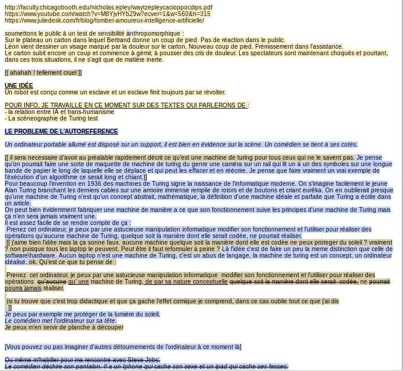
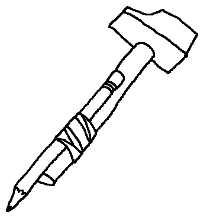
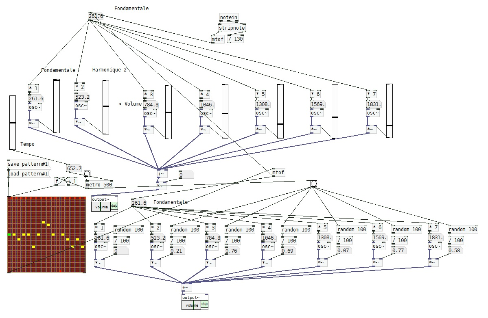
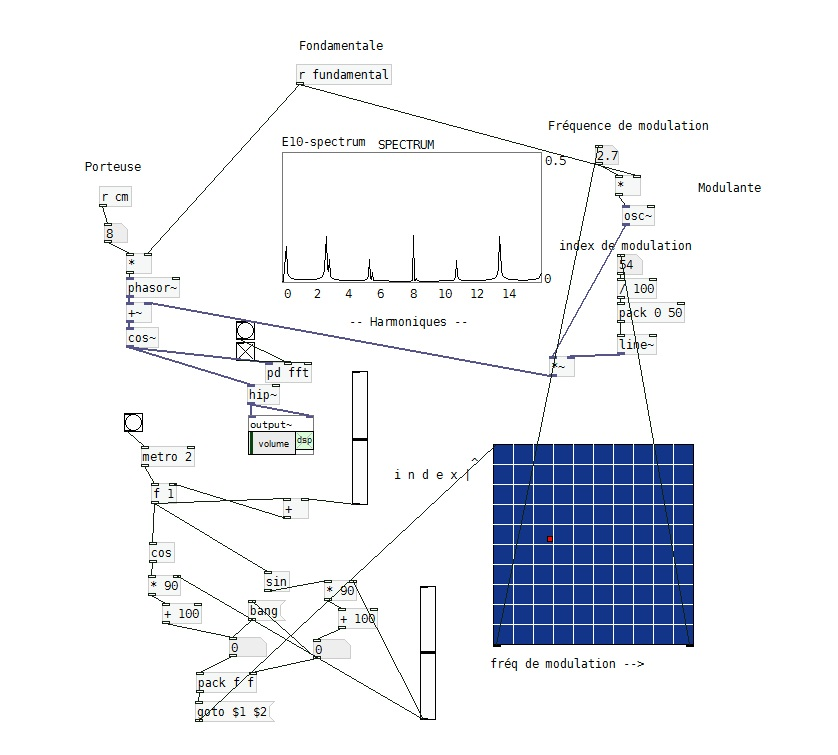
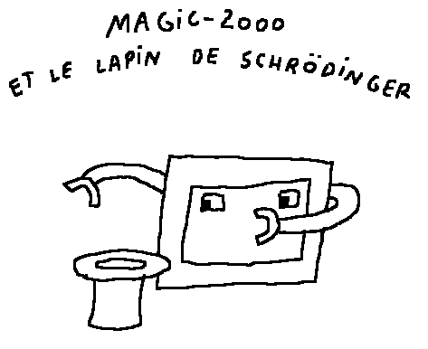

Présentation du projet de création
==================================

Intentions, motivations, hypothèses de recherche.

Turing test
-----------

*Turing test* est une performance théâtrale, musicale et plastique autour du  thème de l’intelligence artificielle (I.A.). Ce projet nous a été  inspiré par les travaux du mathématicien Alan Turing, personnage  incontournable de la culture populaire moderne qui, dès les années 30, a  posé les bases formelles de l'informatique, de l'algorithmique et de  l'I.A.  Notre ambition est de porter sur une scène de théâtre une  version adaptée de son célèbre test de Turing (jeu de l'imitation) où un  juge (le public) doit évaluer l'aptitude d'une intelligence artificielle  à imiter l'intelligence humaine.

Cette  proposition théâtrale met en scène trois comédiens qui interagissent sur le plateau avec plusieurs formes d'intelligence artificielle. Ces  échanges verbaux, musicaux ou kinesthésiques révèlent autant les  perspectives vertigineuses que les limites actuelles de l'I.A. Entre ces  confrontations, les trois chercheurs proposent, via un procédé de  fabrication de films d'animation en direct, une vision distanciée et poétique de ce qui se joue dans les rapports de l'humain aux machines qu'il a créées.

Cette  double approche est une hypothèse de recherche d'une forme mixte d'expression théâtrale déjà expérimentée dans [L'ENVOL](http://cienokill.fr/spectacles/lenvol/) et que nous  aimerions approfondir dans *Turing test*. D'un côté les corps et le texte  qui projettent vers le public la réflexion portée par les comédiens, de  l'autre le cinéma, convoqué sur scène, fabriqué en direct, et qui agit comme une respiration, une ouverture vers une perception plus large du  même sujet où se mêlent sensations, émotions et poésie.

Derrière  ce projet, il y a le questionnement lié au progrès récent de l'intelligence artificielle et de l'apprentissage profond dont les  ordinateurs sont aujourd'hui capables. En quoi ces nouvelles avancées technologiques vont-elles modifier notre quotidien et notre avenir ? Dans quel  délai ? Pour quel idéal ? Faut-il craindre l'intelligence artificielle ou faut-il  craindre ceux qui aujourd'hui développent et contrôlent ces technologies (Google, Facebook, Tesla…). À qui ces avancées techniques vont-elles  profiter ? À une poignée d'élus ou à toute l'humanité ?  Quelles  conséquences sur le travail, l'âge de la mort, les libertés  individuelles, les valeurs de l'humanité, le sens de la vie ?

Personne  ne peut répondre à ces questions et prédire dans quelle mesure et dans  quel sens l'I.A. va bouleverser l'humanité, car tout se joue et s'écrit en ce moment à une vitesse folle. Mais il nous semble important que la  réflexion sur le sujet ne se limite pas aux prises de parole des experts  ou aux projections des industriels. En portant cette problématique au théâtre, notre ambition est d'inciter le public à s'interroger sur les  enjeux liés aux progrès de l'I.A. à envisager d'autres perspectives, d'autres angles pour appréhender ce sujet et à se sentir légitime pour participer au débat.

Méthode de travail
==================

Comment nous écrivons.

Le corpus.
---------

S'attaquer à un sujet comme l'intelligence artificielle n'est pas une tâche facile :
-   Tout le monde en parle donc beaucoup de gens se sont construit un avis dessus.
-   Beaucoup d'artistes l'ont exploré, et parfois avec brio.
-   Un grand nombre de scientifiques y travaillent à côté de qui nous ne serons toujours que des amateurs.
-   Beaucoup d'idées fausses et d'a priori sont fortement ancrés dans les esprits.

Nous avons commencé à travailler sur ce spectacle en octobre 2017, et nous avons constaté que sur ce sujet qui nous intéressait tous les trois, et sur lequel nous avions déjà beaucoup réfléchi à differents niveaux, nous avions beaucoup de lacunes et de points de désaccord. Il nous a semblé important de commencer la création par un travail de recherche plus théorique que scénique.

L'idée est de ne pas concevoir une forme trop précise sans être d'abord précis sur le fond, nous nous sommes donc lancés dans la rédaction de textes que nous écrivons à six mains, d'abord sur un pad puis sur github, un outil à la base conçu pour des collaborations entre programmateurs informatiques sur l'écriture de code, qu'il nous semblait à la fois amusant de détourner vu le thème du spectacle et parfaitement adapté à notre façon de travailler. Nous avons commencé à accumuler :

-   Des textes destinés à être lus (intentions de mise en scène, intentions de propos, réflexions sur les outils, réflexions sur le pourquoi du comment)
-   Des textes destinés à être dits pendant le spectacle
-   Des petites idées (de petites scènes, d'objets à créer, d'histoires à raconter, de manipulations ou d'images)
-   Des morceaux (de musique, de dessin, de carton)
-   Des références (une chronologie, des captures d'écran, des citations de livre, d'articles, des fiches de lecture)
-   Des débats entre deux ou trois de nous trois sur des sujets de discorde
-   D'autres choses encore (comme n'importe quoi)

Ces textes constituent l'écriture du spectacle. Ce ne sont pas les éléments d'un dossier de diffusion. Ce n'est pas un travail préparatif. Ce corpus de texte en évolution continue **c'est** le spectacle, c'est *Turing test*. Au même titre que le texte d'une pièce de théâtre classique **est** la pièce.

Ça ne veut pas dire que tout ce que l'on peut lire dans ce corpus apparaitra explicitement sur scène. Au moment où j'écris ces mots, il n'y a encore que très peu de ces textes qui sont destinés à être joués ou récités. Mais tout sera là, au moins discrètement, des paragraphes de théorie, cachés dans une réplique ou dans le design d'un robot. Des scènes abandonnées dans la mémoire d'Alan.

---------------------------------------------------------------------------------------------------------------------------

*Le Pad, premier lieu pour la co-écriture de Turing Test. Chaque personne est représentée par une couleur*

Les outils
==========

Réflexion sur la nature des outils que nous utilisons pour produire des sons et des images.

S'emparer de ses outils
-----------------------

L'avènement des nouvelles technologies incite plus que jamais les artistes à s'interroger sur leurs outils. Un dessin fait avec Photoshop n'est pas moins un dessin qu'un autre réalisé au crayon. Mais alors, quelles différences y a-t-il entre les deux ? On parle de musique assistée par ordinateur (MAO) mais pourquoi ne dit on jamais d'un violoniste qu'il fait de la  musique assistée par instrument à cordes ?

En vérité il n'y a aucune différence essentielle entre un outil numérique et un outil analogique ou mécanique. Il y a toujours deux forces qui se confrontent lorsqu'on utilise à des fins artistiques un outil, quel qu'il soit. D'un côté l'outil facilite la tâche que l'on doit accomplir, de l'autre il nous enferme dans un cadre de possibilités restreint. Un crayon permet de dessiner beaucoup plus facilement que l'on ne peut le faire avec son doigt sur le sable, mais il ne permet de faire rien d'autre qu'un dessin au crayon. L'utilisation d'un logiciel de dessin offre une grande liberté, mais jamais ce que l'on produira avec ressemblera à autre chose qu'à un dessin fait avec ce logiciel.

Il suffit alors d'avoir conscience de ce qu'un outil nous permet et de ce en quoi il nous formate. De choisir ses outils en conséquence. D'aller, quand c'est intéressant, à contre sens de l'utilisation attendue de l'outil. De modifier ses outils et, quand c'est nécessaire, de les concevoir.

Si l'utilisation de logiciels libres (open source) est importante pour certains artistes. C'est que la philosophie du libre implique une réflexion sur l'outil. Un logiciel comme Photoshop est une propriété de la marque Adobe et l'on ne fera jamais autre chose avec que ce qu'Adobe a prévu pour nous. Un logiciel comme GIMP, très similaire en apparence, est ouvert : on peut voir comment il marche et donc, potentiellement, on peut le transformer en ce qu'on veut qu'il soit.

Dans Turing Test, les machines, programmes et instruments que nous utilisons dans les phases de production de dessin animé et de musique sont assez différents, mais témoignent d'une sensibilité que nous partageons à propos de la question de l'outil.

Fabien et Pure Data
--------------------

Pure Data (Pd) est un logiciel libre de programmation graphique orienté vers la création musicale et multimédia en temps réel écrit par M. Puckette. Il permet de faire transiter des informations entrantes le long de liens matérialisés dans l'interface graphique par des lignes reliant différents objets. Chaque objet permet d'agir sur l'information entrante et ainsi de délivrer une nouvelle information, de l'aiguiller, de la traiter, de la modifier … la possibilité pour chacun de créer ses propres objets permet de prolonger à l'infini la liste des objets existants.

Dans le cadre de Turing Test, j'utilise Pd pour créer des instruments électroniques numériques et interactifs. Je contrôle en direct certains paramètres du code grâce à des dispositifs hardware (contrôleurs midi, pads de batterie électronique, etc...)
L'utilisation de Pd s'imposait pour deux raisons :

-  Le rapport de l'homme à la machine que nous souhaitons défendre ici est celui de l'augmentation de la puissance créatrice de l'homme par la machine, par opposition à l'aliénation de l'homme par la machine. Ainsi ce rapport est envisagé du point de vue du bricoleur pour qui la fonction d'un outil n'est jamais entièrement fixée et peut donner lieu à tout moment à un usage nouveau. En créant mon propre synthétiseur avec Pd, je définis à ma guise une zone de liberté sonore à l'intérieur de laquelle la machine évoluera plus ou moins aléatoirement. En direct, je modifie les contours de cette zone de liberté en fonction de mon inspiration dans le but d’interagir avec les autres improvisateurs présents sur scène.
-  Le code (ou « patch » par analogie avec les synthétiseurs modulaires) c'est-à-dire le câblage des différents objets entre eux est projeté sur l'espace scénique. Ainsi le code qui génère le son et les modifications que j'y apporte au fur et à mesure sont visibles en temps réel à la manière d'une machine dont on aurait soulevé le capot. Des interrupteurs s'allument, des glissières bougent, des formes d'ondes se dessinent au rythme de l'évolution de la musique, montrant à la fois le travail de bricoleur à travers l'organisation approximative des différents modules que j'ai créés, et celui de musicien par la transposition graphique des modifications sonores que je commande.

Léon et Ognon
--------------

Ognon est un logiciel de dessin animé 2D que j'ai développé en Python. Il a été créé au départ pour me permettre de réaliser facilement des animations très simples en noir et blanc que d'autres logiciels me permettaient de faire de manière compliquée. Ce logiciel n'est pas plus puissant qu'un autre, ni plus complet. Il est juste ce dont j'ai besoin. Aussi, le fait de l'avoir programmé de A à Z, bien que ça ait été un travail long et fastidieux, me permet aujourd'hui d'avoir un outil que je comprends dans les moindres détails. Lorsqu'il y a un bug, je comprends très vite d'où il vient et je peux rapidement le corriger. Surtout, je peux adapter le logiciel aux besoins de différents projets.

Pour répondre aux besoins du spectacle, le logiciel a été augmenté pour permettre la réalisation d'animations en direct. Il permet de dessiner et d'animer sous les yeux des spectateurs, sans que ceux-ci voient l'interface du logiciel. Il permet aussi de synchroniser la lecture des animations au rythme de la musique.

Ognon ne permet que de faire des dessins monochromes avec une épaisseur de trait constante. Lorsqu'on veut effacer un trait, on ne peut pas en effacer une partie, le trait doit être supprimé en entier. Ces choix peuvent paraitre étranges, et ne sont pas habituels dans les logiciels de dessin. Mais ils correspondent à la façon dont je pense le dessin. J'accorde beaucoup d'importance à la notion un peu idéaliste de trait pur, comme un texte a besoin d'un support et d'une police de caractère pour être lu, un dessin doit avoir une matérialité pour être vu. Mais ce qui constitue en quelque sorte l'essence du dessin ce sont ses traits, leur nombre, leur forme, leur longueur, la manière dont ils se coupent ou se croisent, ni la texture de la feuille ni la dureté de la mine du crayon.

Bertrand et le Synthé Modulaire
-------------------------------

Mon synthétiseur modulaire est un objet physique composé de modules élémentaires (générateurs de sons, générateurs de notes, filtres, amplis, mélangeurs, etc.) que l'on connecte entre eux avec des câbles pour créer de la musique électronique. L'intérêt de cet instrument réside dans le fait que l'on peut personnaliser le choix des modules, les relier de façon totalement libre et obtenir ainsi un instrument unique propre à générer des textures sonores originales. Ce principe permet à des milliers de petits fabricants de proposer sur le marché des modules singuliers et permet aux musiciens de s'affranchir des grands groupes industriels qui ont tendance à formater le design sonore de leurs synthétiseurs pour des raisons commerciales (Roland, Korg, Yamaha, Akay, Kurzweil, Moog, etc… ). Un des premiers modules dont j'ai fait l'acquisition s'appelle TURING MACHINE. Il est fabriqué par Tom Whitwell de Music Thing. L'intérêt de ce module est qu'il génère de façon pseudo-aléatoire des notes et des rythmes en fonction de contraintes établies par l'interprète : degré d'aléatoire, influence cyclique, etc. Ce module m'a ouvert la porte de la musique générative. Le synthétiseur modulaire acquiert alors une sorte d'autonomie créative et produit une forme musicale non-déterministe qui s'invente perpétuellement et ne peut être répétée. Une forme primaire d'intelligence musicale ?

-----------------------------------------------------------------------------------------------------------------------------

*Deux capture d'écran du logiciel Pure Data*

Pratiques croisées
==================

*Turing Test* est une œuvre théâtrale où sont conviées plusieurs techniques et pratiques artistiques.

Le cinéma
---------

Léon dessine sur une tablette graphique reliée à son logiciel Ognon. Les traits apparaissent progressivement sur l'écran et se combinent pour donner vie à des formes qui se mettent en mouvement. De part et d'autre de Léon, Bertrand et Fabien composent des sons et des musiques synchrones avec les images. Le résultat est un film d'animation qui raconte une histoire d'intelligence artificielle, d'humains et de robots. Pendant quelques minutes le spectateur est au cinéma et en même temps dans le studio où le film se construit en temps réel. Une fiction dans la fiction qui capte son attention, l'emmène dans une autre dimension et l'invite à imaginer différemment son rapport à l'intelligence artificielle.

Sur la scène, le cinéma conserve son identité. Les films diffusés pendant le spectacle sont perçus comme des courts métrages, œuvres homogènes et résolument cinématographiques dans leur relation au sens, au temps et à l’espace. Autrement dit, des histoires avec un début et une fin, projetées sur un écran.

La musique
----------

La bande-son du spectacle est une suite d'improvisations de musique électronique interprétée par Bertrand et Fabien sur des dispositifs analogiques (synthétiseurs  modulaires) et numériques (Pure data). Elle apparait soit en association avec les animations créées par Léon avec son logiciel Ognon, soit de manière libre pendant le spectacle.

La magie
--------

Quelques années après la mort du grand illusionniste et fabricant d’automates Robert Houdin, Georges Méliès rachète son théâtre pour y créer ses soirées fantastiques. Sa mise en scène mélange science et illusion, musique et humour, automates et prestidigitation. Dès 1896, il introduit son kinétographe qui lui permet de projeter des séances de vues animées. Le public est médusé devant cette invention et devant les trucages et les effets spéciaux dont il devient rapidement le spécialiste. Dès lors, grâce à Méliès, magie et cinématographe s'enrichissent mutuellement. Sur ses tournages, Méliès exploite tout son savoir-faire d'illusionniste pour produire des images improbables qu'il projette ensuite sur la scène de son théâtre. C’est pour lui le début d’une période de grande créativité, pendant laquelle il réalisera près de 600 films. Grâce à son génie poétique, il ne cessera de proposer à son public une vision romantique et décalée de la science. (Le voyage dans la lune, Le voyage à travers l'impossible…)

Cette proposition théâtrale où la magie s'exprime sous toutes ses formes, des plus concrètes au plus poétiques, est une source d'inspiration pour notre spectacle Turing test. En fabriquant des séquences d'images et des films en direct, en interagissant avec des robots, héritiers des automates de Robert Houdin, en nous servant de l'illusion pour donner vie à nos machines et poser ainsi un regard distancié sur les progrès de la science et sur les perspectives qui en découlent pour l'humanité, nous nous inscrivons dans la tradition de ces magiciens innovants et géniaux que furent Houdin et Méliès.

