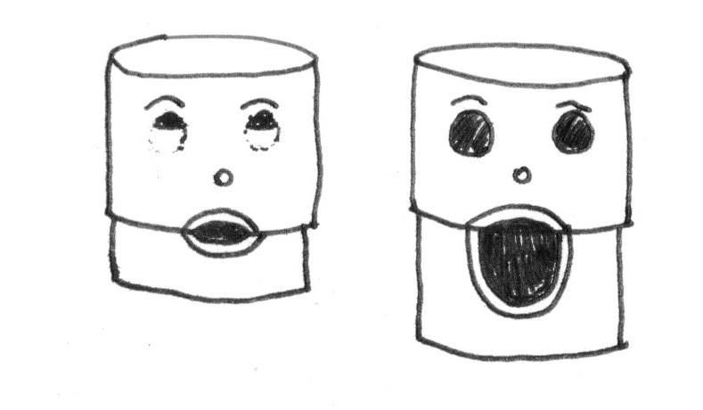
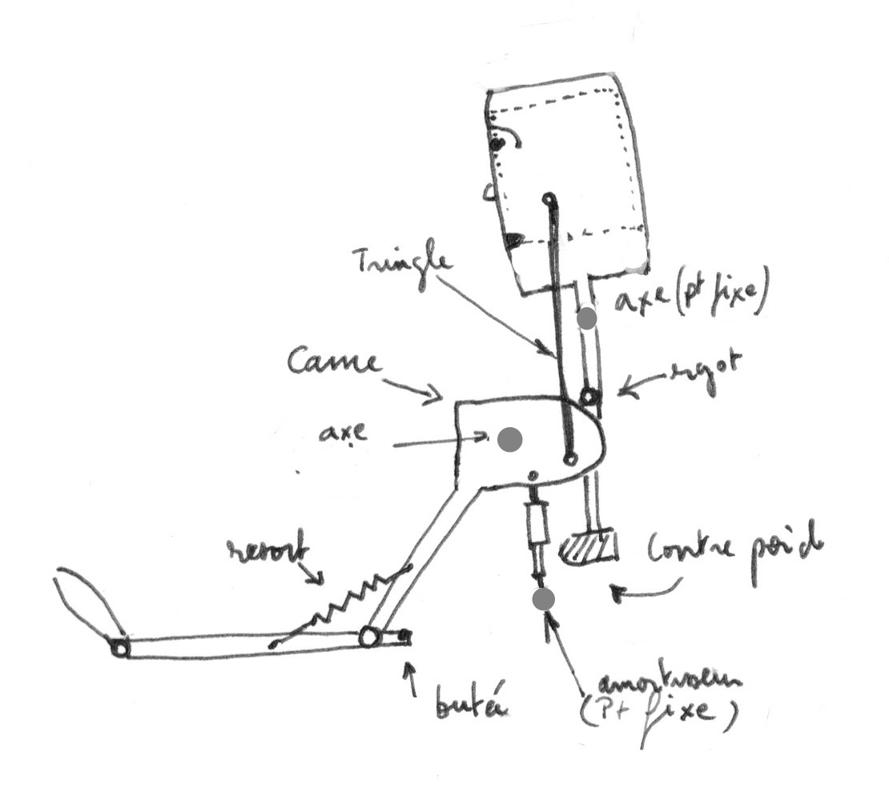
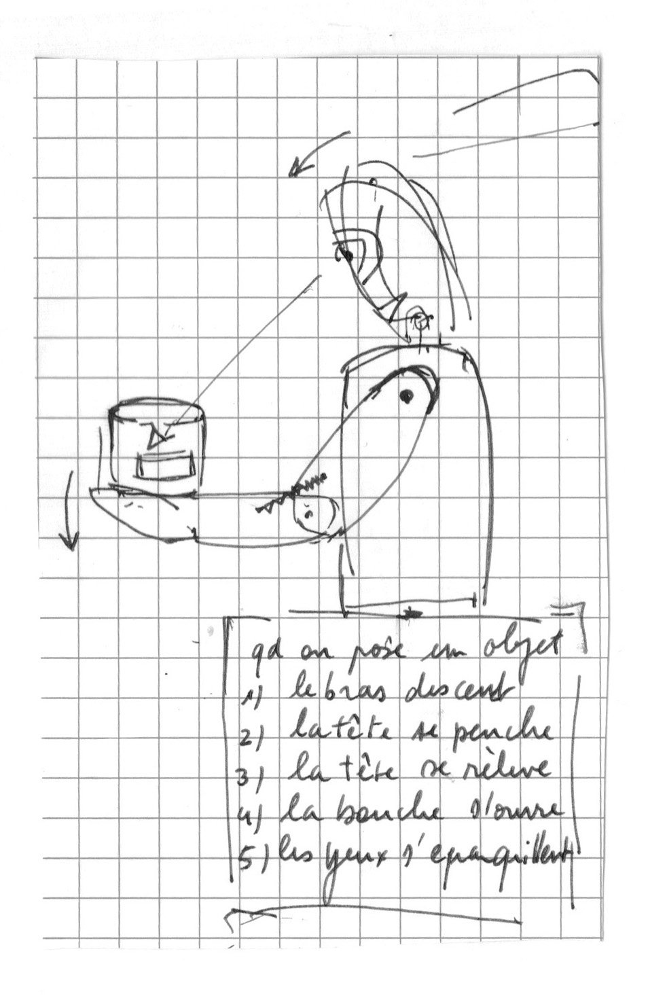

# OTTO (Robot étonnable)

## Esthétique, allure du robot

Buste

## Matériaux envisagés

## Hypothèses de construction, description technique

Robot entièrement mécanique, le mécanisme est construit de manière à ce que lorsqu'un objet est posé sur le plateau, les traits de son visage se modifient pour qu'il ait l'air étonné : ses yeux se baissent vers l'objet déposé, sa bouche s'ouvre, ses sourcils et son chapeau se soulèvent.

## Moment envisagé pour la construction

Une première version a été construite à l'usinototpie.
