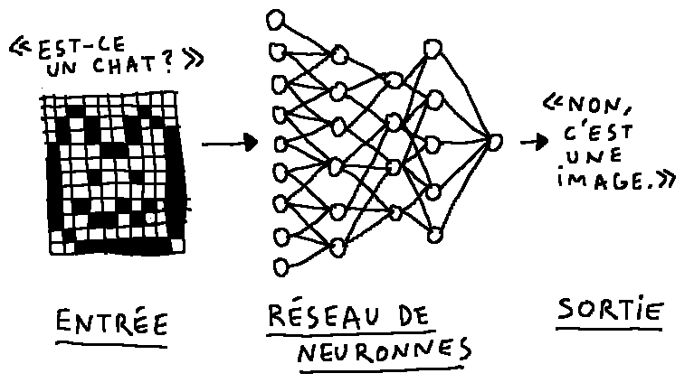

Machine Learning
================

Type
----

Texte théorique

Résumé
------

Etat des lieux d'un des domaines de l'Intelligence Artificielle qu'on appelle le machine learning ou l'apprentissage automatique.

Trouver le chat
----------------

Certaines tâches évidentes pour un cerveau humain, par exemple reconnaître la présence d'un chat dans une photo, ont longtemps tenu les programmateurs informatiques en échec. Aucun programme conçu par un homme n'apportait une solution fiable pour résoudre ce problème. On a d'abord pensé que c'était parce que les chats étaient compliqués à identifier, mais les chercheurs ont essayé avec d'autres animaux et même avec des objets comme des voitures ou des chaises et les résultats étaient tout aussi décevants.

Résumons le problème : je veux construire un programme qui aura, une entrée et une sortie. L'entrée ce sera l'image, la sortie ce sera la réponse à la question "y a-t-il un chat sur cette image ?" oui ou non. L'ordinateur ne peut travailler qu'avec des données numériques. La sortie sera donc 1 s'il  y a un chat et 0 sinon. Pour l'entrée, je suis obligé de prendre en compte la valeur de chaque pixel de mon image, même pour une petite photo en noir et blanc de 100px par 100px, ça me fait 10 000 valeurs différentes.

Trouver un algorithme, c'est-à-dire une suite de calculs, qui me permettrait de transformer les 10 000 chiffres de mon image en un 1 ou un 0 selon que l'image comprend un chat ou non, semble une tâche titanesque. C'est pour résoudre ce problème que des chercheurs ont inventé l'apprentissage supervisé à réseau de neurones.

L'apprentissage supervisé
-------------------------

En s'inspirant du fonctionnement du cerveau, on place entre l'entrée et la sortie, des couches successives, composées chacune de neurones formels. Les neurones des différentes couches sont reliés par des connexions synaptiques. La première couche contient autant de neurones qu'il y a d'entrées (10 000 dans notre exemple) la dernière contient autant de neurones qu'il y a de sorties, un seul.

Le fonctionnement de ce système est extrêmement simple. Un neurone reçoit des chiffres de la couche supérieure, il les additione et renvoie le résultat vers des neurones de la couche inférieure. L'information passe par le connecteur qui agit en multipliant la valeur par un coefficient. Ce sont ces coefficients qui sont importants. S'ils sont correctement choisis l'algorithme fonctionnera.

On commence par mettre des coefficients au hasard et on teste l'algorithme. Malheureusement, ça ne marche pas. Pour que l'algorithme fonctionne, il faut l'entrainer avec un très grand nombre d'exemples préalablement annotés par des humains qui ont décidé avec leur cerveau si oui ou non il y avait un chat dans la photo. Chaque exemple renforce l'aptitude de l'algorithme à répondre correctement à la question. Selon qu'elle échoue ou parvienne à détecter la présence d'un chat dans une photo, la machine va essayer d'ajuster la force de chaque connexion synaptique, pour changer la manière dont l'information qui se propage jusqu'à la sortie sera traitée par chaque couche. Les connexions vont se renforcer ou s'affaiblir si on augmente ou diminue la valeur du coefficient. Au fur et à mesure, l'algorithme va en quelque sorte apprendre de ses expériences et proposer toujours ce qui lui semble une meilleure manière d'accomplir son objectif.

Un enfant n'aura besoin que de quelques images pour identifier définitivement un chat sur une photo, mais dans certains cas il en faudra plusieurs millions à l'algorithme pour un résultat aussi fiable. Une des contraintes de cette méthode est donc d'obtenir suffisamment d'exemples annotés en amont de l'apprentissage. On comprend pourquoi Facebook est un leader dans ce domaine de recherche car ses ingénieurs peuvent nourrir leurs algorithmes des milliards d'images annotées et postées par les internautes sur leur réseau social.

Ce qui est singulier dans cet apprentissage, c'est que l'ajustement des paramètres synaptiques reste opaque même pour le concepteur de l'algorithme. On comprend pourquoi l'algorithme, à chaque étape de l'apprentissage, a fixé telles valeurs plutôt que d'autres, mais on ne sait pas modéliser a priori l'évolution de ces ajustements, il nous dépasse. L'algorithme d'apprentissage ne peut pas nous expliquer sa façon de penser. C'est une quasi-boite noire dont le fonctionnement échappe à son créateur ce qui représente une vraie rupture dans l'évolution de l'intelligence artificielle.

L'apprentissage non supervisé ou prédictif
------------------------------------------

A l'inverse de l'apprentissage supervisé, l'apprentissage non supervisé ne nécessite pas d'exemples annotés par des humains et ne génère pas de sortie "a priori".

En apprentissage non supervisé il n'y a pas d'objectif précis. La machine analyse les données, les regroupe par affinité et essaie de repérer des motifs, des régularités. A force de tomber sur des images de paysage, elle peut identifier que ces images ont des points communs. Il y a souvent une zone bleue sur la partie supérieure et parfois, dans le bleu, peuvent se trouver des formes blanches.

Sa propre structure va se modifier pour traiter efficacement une tache blanche au milieu d'un aplat bleu. Elle va en quelque sorte trouver ça normal ou habituel de voir ce genre d'images. Si on lui montre une photo avec des nuages roses ou carrés, elle saura que c'est quelque chose d'inhabituel.

Cette méthode qui n'en est qu'à ses balbutiements permettrait à la machine d'acquérir du sens commun et une compréhension suffisante du monde pour en construire un modèle et prédire des actions simples. Par exemple avec une vidéo d'une enfant soufflant une bougie, anticiper que la bougie va s'éteindre. 
 
Finalement, pour les humains le sens commun se manifeste surtout quand on voit quelque chose qui choque ce sens commun. Si on regarde l'intérieur d'un chapeau vide et que l'on détourne quelques instants le regard, notre sens commun nous dit que le chapeau est toujours vide même si je ne le regarde plus. Par contre si un lapin sort tout d'un coup du chapeau, cela choque mon sens commun parce que cela ne correspond pas à mon modèle de la réalité, ce n'est pas ce que j'aurais prédit ! 

Les  chercheurs qui travaillent dans ce domaine sont convaincus que ces  formes d'intelligence artificielle basées sur un apprentissage  prédictif seront capables de rivaliser avec les hommes dans tous les domaines de l'intelligence. Yann Le Cun, sommité mondiale de l'I.A.  affirme que ces machines auront des émotions, des objectifs, des motivations, des désirs et seront capables de prendre des décisions.

---

Continuer la lecture : [**Les outils**](les-outils.md)
